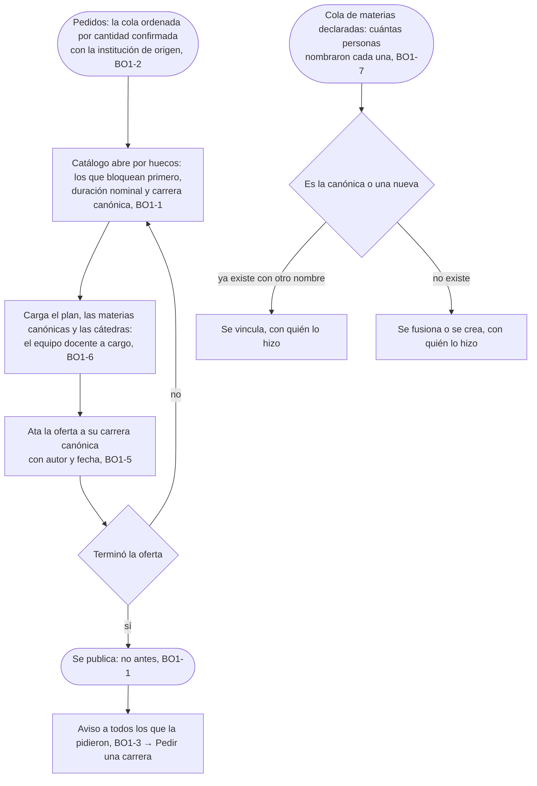
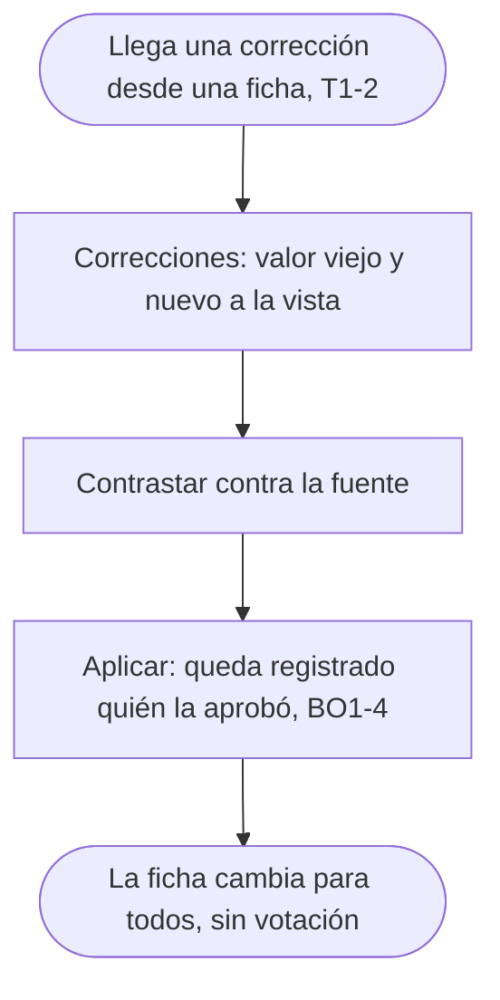
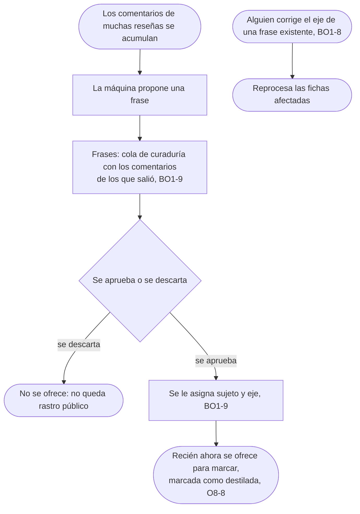
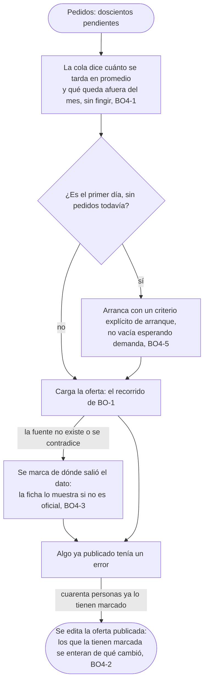
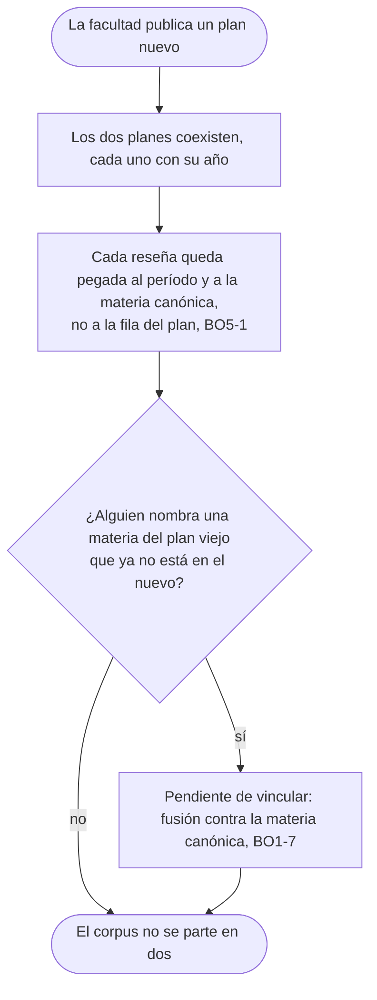

# Sostener el catálogo: el flujo

> Reemplaza a las filas BO-1 (Cargar lo que piden, por prioridad), BO-2 (Contrastar una corrección contra la fuente), BO-9 (Destilar y clasificar frases nuevas), BO-5 (Cuando la facultad reforma el plan) y la mitad de BO-7 (Cuando la cola nos gana) que habla de la cola del catálogo, de la tabla de flujos del [mapa](../../design/product-map.md). Persona: Sofía (BO-1, BO-2, BO-5, BO-7) y quien cura las frases (BO-9). Disparador: la cola de pedidos, una corrección que llega desde una ficha, los comentarios que se acumulan para destilar, o la facultad publicando un plan nuevo. Stories que cubre: BO1-1 a BO1-9, BO4-1, BO4-2, BO4-3, BO4-5, BO5-1, T1-2.

### BO-1: cargar lo que piden, por prioridad

### BO-2: contrastar una corrección contra la fuente

### BO-9: destilar y clasificar frases nuevas

### Cuando la cola nos gana: doscientos pendientes, dos carreras por semana

### BO-5: cuando la facultad reforma el plan

## Salidas y errores

- **No se publica a medias**: mientras falte un hueco bloqueante, duración nominal o carrera canónica, la oferta no sale aunque el resto esté cargado (BO1-1).
- **Una materia declarada puede vincularse a una canónica existente o volverse una nueva**, y en los dos casos queda registrado quién lo hizo (BO1-7).
- **Aplicar una corrección queda registrado con quién la aprobó** (BO1-4): no es un cambio anónimo del catálogo.
- **Una frase destilada que se descarta no se ofrece nunca** ni deja rastro en la lista pública (BO1-9).
- **Corregir el eje de una frase reprocesa las fichas que la usan** (BO1-8): nunca es un cambio aislado.
- **El primer día no hay pedidos**: la cola arranca con un criterio explícito, no vacía esperando demanda (BO4-5).
- **La fuente del dato no existe o se contradice**: se marca de dónde salió y la ficha lo muestra cuando no es oficial (BO4-3); no bloquea cargar, declara el origen.
- **Algo publicado tenía un error y ya lo usan**: se edita la oferta publicada y los que la tienen marcada se enteran de qué cambió (BO4-2); no hay que despublicar para corregir.
- **La materia del plan viejo que nadie vinculó todavía** sigue sosteniendo las reseñas hechas con ella: no desaparece con la reforma (BO5-1).

## Lo que el flujo no dibuja y la ficha de la pantalla decide

Cómo se prioriza entre varios huecos bloqueantes a la vez; el criterio para decidir si dos ofertas son la misma carrera canónica; cuántos comentarios hacen falta para que la máquina proponga una frase.
