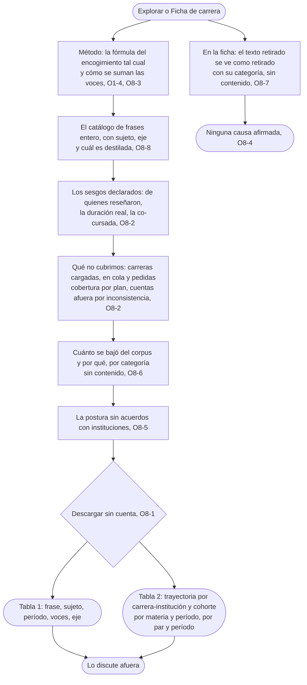

# Llevarse el dato: el flujo

> Reemplaza a la fila 07 de la tabla de flujos del [mapa](../../design/product-map.md) (Rocío se lleva el dato). Persona: Rocío. Disparador: entra a Explorar o a una Ficha de carrera y sigue el link a Método. Stories que cubre: O8-1, O8-2, O8-3, O8-4, O8-5, O8-6, O8-7, O8-8, O1-4.

## Salidas y errores

- **Lo que se descarga es lo que se publica**, ni más fino ni más grueso: nunca nombre, cuenta ni perfil, y los testimonios no se exportan en bloque.
- **Cuentas afuera por inconsistencia**: se publica cuántas, y no entran a ningún agregado.
- **El texto retirado** se ve como retirado con su categoría; sus frases siguen contando (O8-6, O8-7).
- **Ninguna ficha afirma una causa** (O8-4); la descarga es sin cuenta y sin registro (THESIS, "Posición").

## Lo que el flujo no dibuja y la ficha de la pantalla decide

Cómo se organiza Método en una pantalla o varias; el formato exacto de las columnas del CSV; con qué periodicidad se regenera el crudo.
