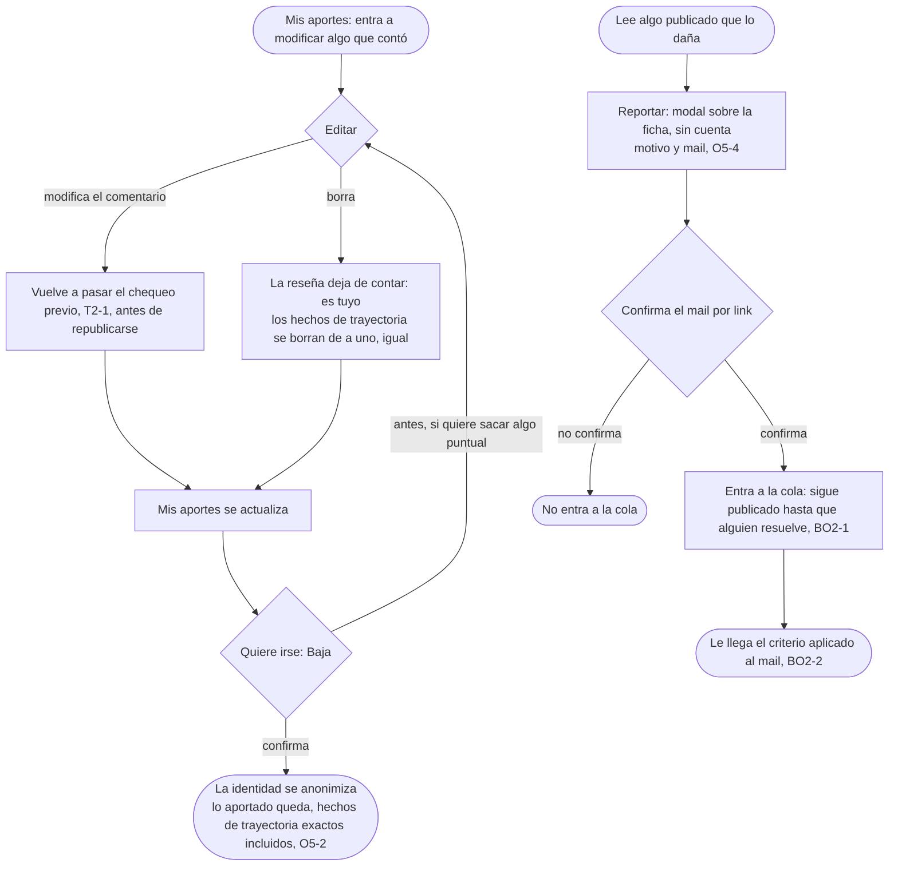

# Deshacer: el flujo

> Reemplaza a la fila 09 de la tabla de flujos del [mapa](../../design/product-map.md) (Deshacer, lo que hace que se animen), y dibuja también el reporte sin cuenta, que el mapa tiene como acción inline sobre la ficha. Personas: quien ya aportó (Matías, Lucía, Diego); quien lee, incluido el que una reseña difama, para reportar sin cuenta (O5-4). Disparador: entra a Mis aportes para modificar algo que contó, o lee algo publicado que lo daña. Stories que cubre: O5-1, O5-2, O5-4, T2-1, BO2-1, BO2-2.

## Salidas y errores

- **Comentario editado**: vuelve al chequeo previo antes de republicarse, el mismo que corre al reseñar (T2-1).
- **Reseña borrada**: deja de contar en cualquier agregado; los hechos de trayectoria declarados se borran de a uno si el autor lo pide, no hay borrado en bloque.
- **Baja de cuenta**: irreversible en la identidad (se anonimiza) y preserva lo aportado exacto (O5-2, D10); lo que se quiera sacar puntual, antes por Editar.
- **Reporte sin mail confirmado**: no entra a la cola.
- **Mientras el reporte espera**: sigue publicado (BO2-1); nada baja solo por cantidad de reportes.

## Lo que el flujo no dibuja y la ficha de la pantalla decide

Qué campos de una reseña publicada admite Editar (período, materia, o solo frases y comentario); el copy exacto de Baja; el motivo desplegable de Reportar y cuánto tiempo se guarda un aporte a medias antes de retomarlo o perderlo.
