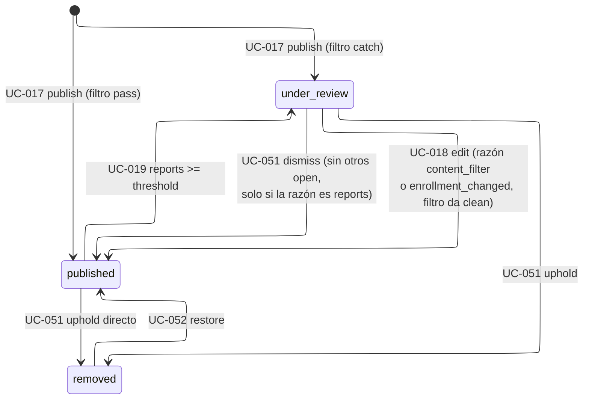
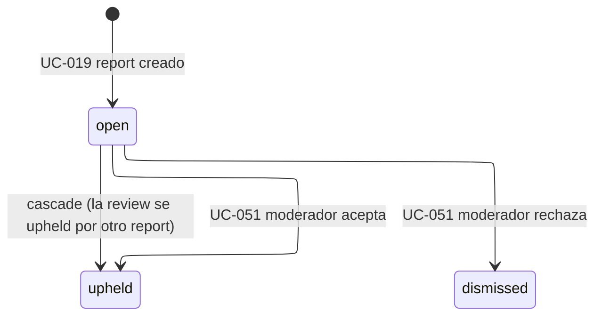
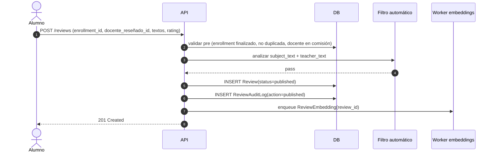
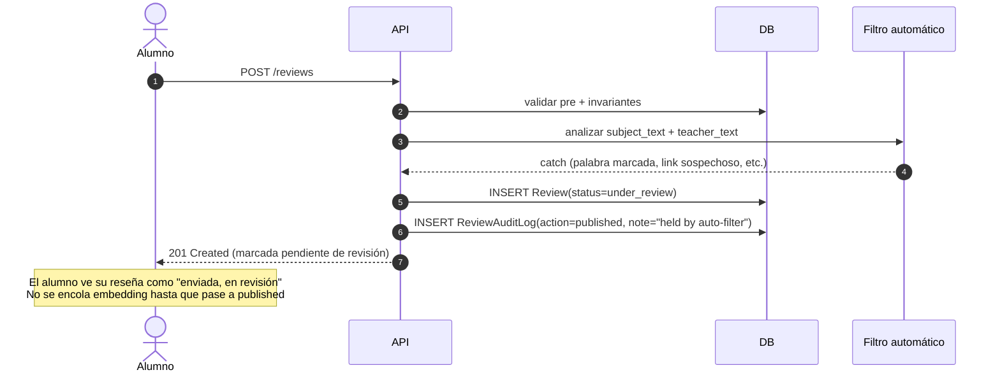
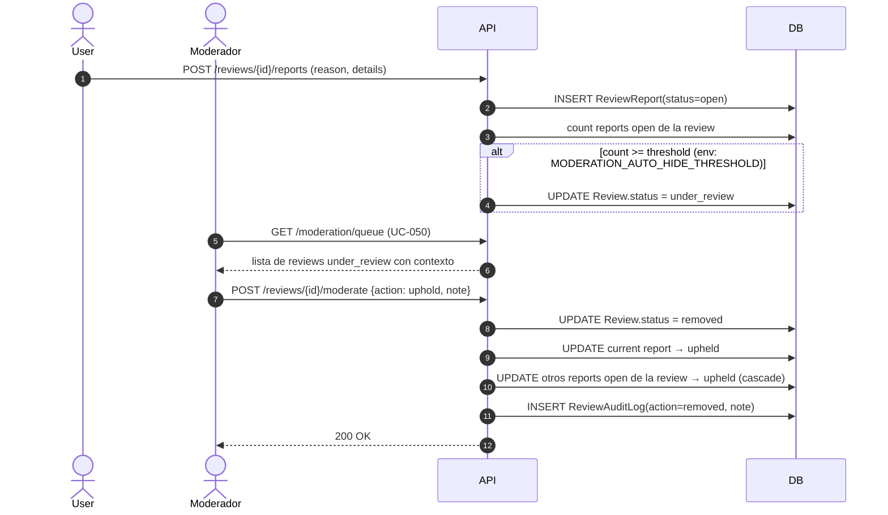
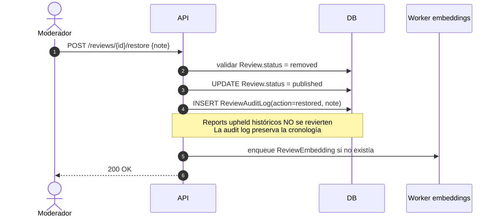

# Review Lifecycle (planb)

> **En retiro (2026-08-16), con una parte que sobrevive**: la mitad de moderación (reportes, uphold/dismiss, cascadas) es la que BO2 y BO5 del mapa retoman; se porta al lifecycle del sistema nuevo cuando ese diseño exista. El resto (la reseña texto-libre y sus estados): este documento describe código que todavía existe y que [ADR-0063](../../decisions/0063-the-product-is-a-pressure-instrument.md) declara en retiro con la versión anterior del producto. Sigue siendo válido como descripción de ese código mientras viva; se elimina con la poda registrada en [STATUS.md](../../plan/status.md).

Ciclo de vida de una reseña desde su publicación hasta su eventual remoción o restauración. Cubre:

- State machines de `Review.status` y `ReviewReport.status`.
- Matriz de transiciones con side effects (audit log, cascades, jobs encolados).
- Sequence diagrams de los flujos críticos cross-actor.
- Invariantes y reglas del lifecycle.

Este documento **expande** los UCs UC-017, UC-018, UC-019, UC-050, UC-051 y UC-052 con vista temporal y de colaboración. La especificación funcional de cada UC vive en [actors-and-use-cases.md](actors-and-use-cases.md).

## States

### `Review.status`

| Estado         | Significado                                                                                | Visibilidad pública |
| -------------- | ------------------------------------------------------------------------------------------ | ------------------- |
| `published`    | Reseña visible públicamente.                                                               | Sí                  |
| `under_review` | En cola de moderación. Puede haber caído por filtro automático, por threshold de reports, o por invalidación al cambiar la cursada (`under_review_reason`, ver más abajo). | No                  |
| `removed`      | Removida por un moderador.                                                                 | No                  |

### `ReviewReport.status`

| Estado      | Significado                                           |
| ----------- | ----------------------------------------------------- |
| `open`      | Pendiente de resolución.                              |
| `upheld`    | El moderador (o cascade) aceptó: la reseña infringía. |
| `dismissed` | El moderador rechazó: el report no procedía.          |

## State machine de `Review.status`

**`under_review` no es una sola causa.** Se alcanza por tres caminos y la fila los distingue con `under_review_reason` (antes un bool `quarantined_by_content_filter` que solo alcanzaba para dos):

- **`reports`** (threshold de UC-019): los reports abiertos cruzaron el threshold. Desestimar el último report la devuelve a `published`. Es la transición del diagrama vía UC-051.
- **`content_filter`** (UC-017/UC-018): el filtro de contenido la frenó al publicar o al editar. Desestimar un report sobre esta reseña NO la restaura: desestimar significa "este report no vale", no "publiquen este contenido", y son dos decisiones distintas que antes llegaban al mismo lugar (alcanzaba con que un tercero reportara una reseña frenada por el filtro para que el dismiss la publicara de rebote). El handler deja una entrada de audit log con `decision: not_restored` para que la decisión que no aplicó quede registrada. La única salida es que el autor edite (ver más abajo): el filtro reevalúa el texto nuevo, y si da clean la reseña pasa a `published`.
- **`enrollment_changed`** ([ADR-0032](../../decisions/0032-destructive-enrollment-edit-invalidates-its-review.md)): la cursada que respalda la reseña cambió de forma destructiva (por ejemplo, el alumno volvió a "cursando" después de haberla dado por aprobada) y la reseña quedó hablando de algo que ya no es cierto. Mismo comportamiento que `content_filter` frente a un dismiss de reports (no la restaura) y frente a una edición (el autor puede editarla para reflejar el nuevo estado real). **Sin escritor implementado todavía**: el modelo ya representa esta razón, pero el consumer cross-BC que la dispara (`EnrollmentRecordEdited` → `InvalidateReview`) no está construido.

**Nota sobre edición:** la edición (UC-018) se permite desde `published`, y desde `under_review` cuando la razón es `content_filter` o `enrollment_changed`: en ambos casos el filtro reevalúa el texto nuevo, y esa reevaluación decide si la reseña sale a `published` o se queda en `under_review` (con la razón siempre en `content_filter`, sea cual sea la razón de entrada). Por eso la edición desde `under_review` sí puede ser una transición real, a diferencia de la edición desde `published` que nunca cambia el estado. Se sigue sin poder editar cuando la razón es `reports`, ni en `removed`, para evitar edit-bombing como evasión de moderación (ver más abajo).

## State machine de `ReviewReport.status`

## Matriz de transiciones de `Review` con side effects

> Los "enqueue de embedding" que aparecen en esta tabla describen el diseño de [ADR-0007](../../decisions/0007-pgvector-deferred-until-there-is-a-real-consumer.md): su revisión (2026-07-26) borró el pipeline hasta que exista un consumidor real, así que hoy ninguna de estas filas encola nada. La tabla se deja tal cual para cuando se retome.

| De → A                       | Trigger                                  | UC     | Side effects                                                                                                                                                                                |
| ---------------------------- | ---------------------------------------- | ------ | ------------------------------------------------------------------------------------------------------------------------------------------------------------------------------------------- |
| `null` → `published`         | publicar, filtro pass                    | UC-017 | `ReviewAuditLog(action=published)`. Enqueue job de `ReviewEmbedding`.                                                                                                                       |
| `null` → `under_review`      | publicar, filtro catch                   | UC-017 | `ReviewAuditLog(action=published, note="held by auto-filter")`. **No** enqueue de embedding: se encola recién cuando pase a `published`.                                                   |
| `published` → `under_review` | N reports abiertos                       | UC-019 | Se registra el report que cruzó el threshold. El auto-hide queda implícito en la transición de Review; no hay entrada de audit adicional.                                                   |
| `published` → `removed`      | uphold sin pasar por under_review        | UC-051 | `ReviewAuditLog(action=removed)`. El report se marca `upheld` con `resolved_at`. Otros reports open de la misma review → `upheld` (cascade).                                                |
| `under_review` → `published` | dismiss (y no quedan otros reports open) | UC-051 | `ReviewAuditLog(action=published, note="restored by moderator after review")`. Report `dismissed` con nota. Enqueue embedding si no había.                                                  |
| `under_review` → `removed`   | uphold                                   | UC-051 | `ReviewAuditLog(action=removed)`. Todos los reports open → `upheld` (cascade).                                                                                                              |
| `removed` → `published`      | restore                                  | UC-052 | `ReviewAuditLog(action=restored, note)`. Reports `upheld` históricos **no** se revierten. Enqueue embedding si no había.                                                                    |
| `published` → `published`    | edición (no es transición de estado)     | UC-018 | `ReviewAuditLog(action=edited, changes={before, after})`. Re-enqueue de embedding sobre el nuevo contenido. Si había `TeacherResponse`, se muestra badge "editada después de tu respuesta". |
| `under_review` → `published` | edición, razón `content_filter` o `enrollment_changed`, el filtro da clean | UC-018 | `ReviewAuditLog(action=edited, changes={before, after})`. La razón se limpia (`null`). Enqueue embedding (primera vez que llega a `published`).                                              |
| `under_review` → `under_review` | edición, razón `content_filter` o `enrollment_changed`, el filtro sigue frenando | UC-018 | `ReviewAuditLog(action=edited, changes={before, after})`. La razón pasa a (o queda en) `content_filter`. **No** enqueue de embedding.                                                      |

## Matriz de transiciones de `ReviewReport`

| De → A                      | Trigger                                   | UC     | Side effects                                                                                            |
| --------------------------- | ----------------------------------------- | ------ | ------------------------------------------------------------------------------------------------------- |
| `null` → `open`             | usuario reporta                           | UC-019 | INSERT `ReviewReport`. Si cruza threshold, la Review se mueve a `under_review`.                         |
| `open` → `upheld` (directo) | moderador acepta                          | UC-051 | `moderator_id`, `resolution_note`, `resolved_at`. Dispara remoción de la Review y cascade.              |
| `open` → `upheld` (cascade) | otro report de la misma Review fue upheld | UC-051 | Mismos campos que el report original. `resolution_note` heredada.                                       |
| `open` → `dismissed`        | moderador rechaza                         | UC-051 | `moderator_id`, `resolution_note`, `resolved_at`. Si era el único open, la Review vuelve a `published`. |

## Sequence diagrams

> Los diagramas 1 y 4 incluyen un participante "Worker embeddings" que representa el diseño de [ADR-0007](../../decisions/0007-pgvector-deferred-until-there-is-a-real-consumer.md): ese worker no está construido (revisión 2026-07-26), así que hoy publicar o restaurar una reseña no dispara ningún enqueue real.

### 1. Happy path: publicación con filtro pass

### 2. Publicación retenida por filtro automático

### 3. Moderación por reports con uphold

### 4. Restauración por apelación

## Reglas del lifecycle

### Edición bloqueada cuando la razón es reports, o si está `removed`

Un alumno **puede** editar una reseña en `under_review` cuando `under_review_reason` es `content_filter` o `enrollment_changed`: la edición vuelve a correr el filtro de contenido sobre el texto nuevo, y esa reevaluación es la única salida de esas dos cuarentenas. Un alumno **no puede** editar una reseña en `under_review` cuando la razón es `reports`, ni en `removed`. Si intenta, el endpoint devuelve 409 (`reviews.review.invalid_status_transition`).

**Why:** permitir editar mientras hay reports abiertos activos abre edit-bombing como vector de evasión: el alumno podría modificar la reseña para burlar al moderador antes de que resuelva los reports. Esa razón no aplica cuando la cuarentena es del filtro de contenido o de un cambio de cursada: ahí no hay un moderador humano juzgando reports abiertos, así que dejar que el autor corrija el texto (y que el filtro lo reevalúe) no abre ese vector; es, de hecho, la única forma de que esas dos cuarentenas se resuelvan. Sobre removidas, el alumno primero debe apelar (que es out-of-flow en MVP, típicamente via email al admin) y ser restaurada.

### Threshold de auto-hide configurable por env var

La cantidad N de reports open que dispara la transición `published → under_review` automática se lee de `MODERATION_AUTO_HIDE_THRESHOLD` (env var o `appsettings.json`). Default: `3`.

**Why env var y no DB-stored config:** el valor se toca en la práctica una vez por año en el peor caso. Mover a `SystemConfig` requiere montar tabla + cache + admin UI, ~3-4 horas de trabajo para un beneficio marginal. El restart de container en Dokploy es un click. Si en el futuro aparecen más parámetros runtime-tuneables, vale la pena consolidar en `SystemConfig`, pero hoy sería prematuro.

### Cascade on uphold, sin reversión on restore

Cuando un moderador upholdea un report, la Review pasa a `removed` y **todos los reports open** sobre esa Review se marcan `upheld` automáticamente con la misma `resolution_note`. No requieren resolución individual.

Si después la Review se restaura (UC-052), los reports cascade-upheld **no** se revierten: quedan marcados upheld aunque la Review vuelva a `published`. La cronología real se reconstruye desde `ReviewAuditLog`.

**Why:** consistente con la intuición de "decisión de moderación = ban del contenido", análogo a bans en plataformas de juegos donde los reports que llevaron al ban quedan como registro aunque el ban se levante después. Evita burocracia sin sacrificar trazabilidad (el audit log tiene todo).

### Embedding solo sobre `published`

> **Diseño diferido**: la revisión (2026-07-26) de [ADR-0007](../../decisions/0007-pgvector-deferred-until-there-is-a-real-consumer.md) borró el andamiaje de embeddings (extensión, worker, pipeline) hasta que exista un consumidor real. Lo que sigue describe cuándo se va a encolar el job el día que se construya, según [ADR-0013](../../decisions/0013-embedding-generation-gated-on-transitions-to-published.md).

El worker de generación de embeddings (ver [ADR-0007](../../decisions/0007-pgvector-deferred-until-there-is-a-real-consumer.md)) se enqueua en las transiciones hacia `published`:

- `null → published` (publicación con filtro pass).
- `under_review → published` (dismiss de reports).
- `under_review → published` (edición con razón `content_filter` o `enrollment_changed`, el filtro da clean).
- `removed → published` (restore).
- Edición de contenido en `published` (re-embedding sobre el nuevo texto).

**Why:** no tiene sentido gastar compute en contenido que puede terminar removido. Además, si un usuario publica contenido problemático y se retiene por filtro, no queremos que quede residuo en la infraestructura de analytics.

### Anonimato en los sequence diagrams

En ningún momento la API expone `enrollment.student_id` o datos derivados del autor en endpoints públicos. Ver [ADR-0009](../../decisions/0009-review-anonymity-is-a-presentation-rule.md). Los moderadores sí pueden ver la identidad (vía audit log y rol de moderator) para detectar patrones de abuso.

## Cross-references

| Tipo       | Referencia                                                                                                                                                                                                 |
| ---------- | ---------------------------------------------------------------------------------------------------------------------------------------------------------------------------------------------------------- |
| UCs        | UC-017 (publicar), UC-018 (editar), UC-019 (reportar), UC-050 (cola de moderación), UC-051 (resolver report), UC-052 (restaurar).                                                                          |
| ADRs       | [ADR-0005](../../decisions/0005-review-anchored-to-the-enrollment-record.md), [ADR-0007](../../decisions/0007-pgvector-deferred-until-there-is-a-real-consumer.md), [ADR-0009](../../decisions/0009-review-anonymity-is-a-presentation-rule.md), [ADR-0032](../../decisions/0032-destructive-enrollment-edit-invalidates-its-review.md). |
| Data model | [`Review`, `ReviewReport`, `TeacherResponse`, `ReviewAuditLog`](../../engineering/data-model.md#context-reviews--moderation).                                                             |
