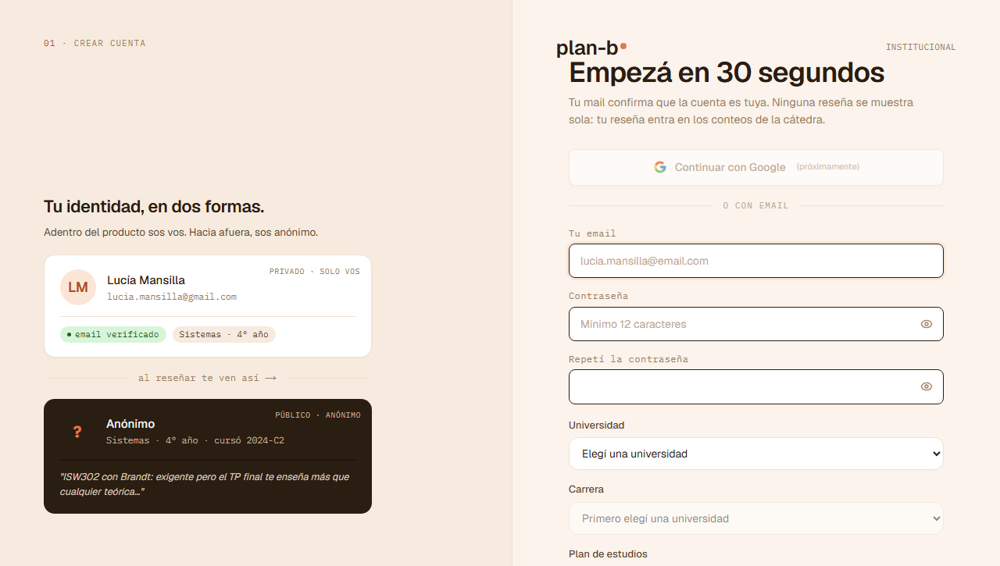
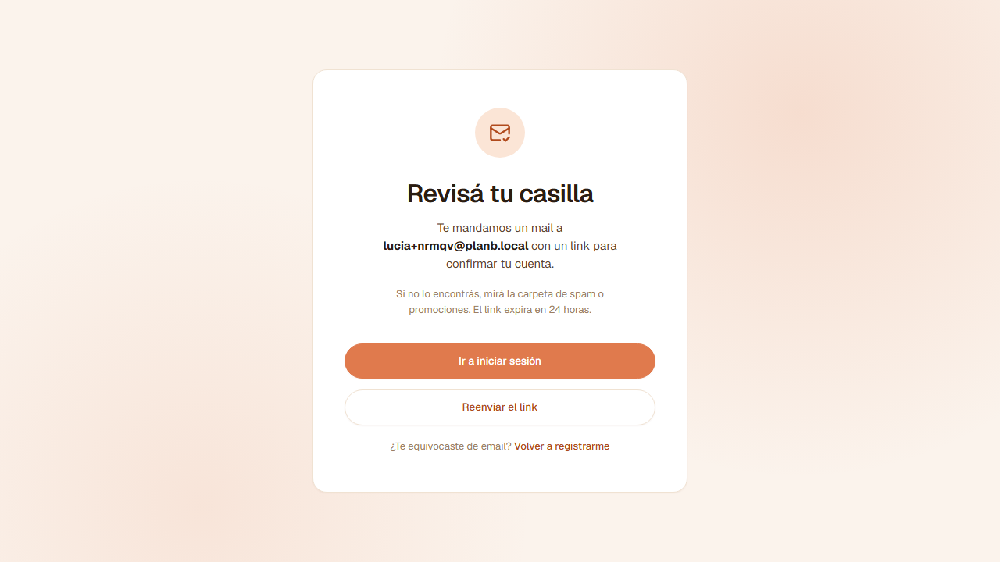
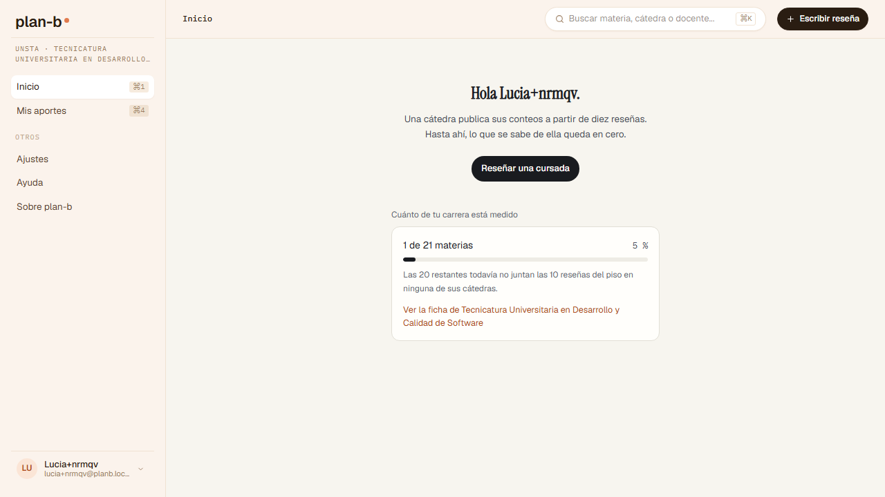
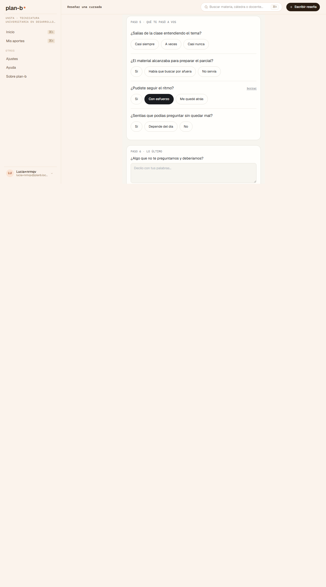
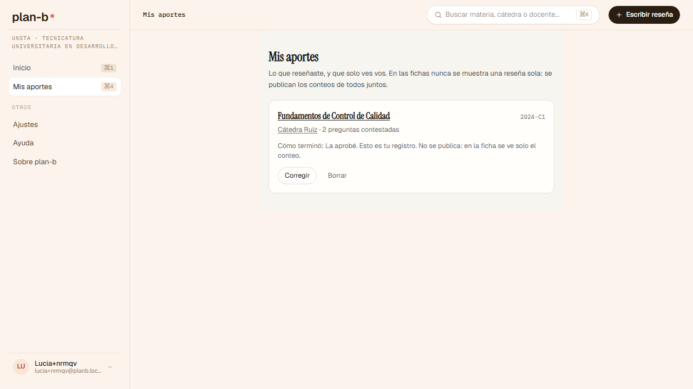
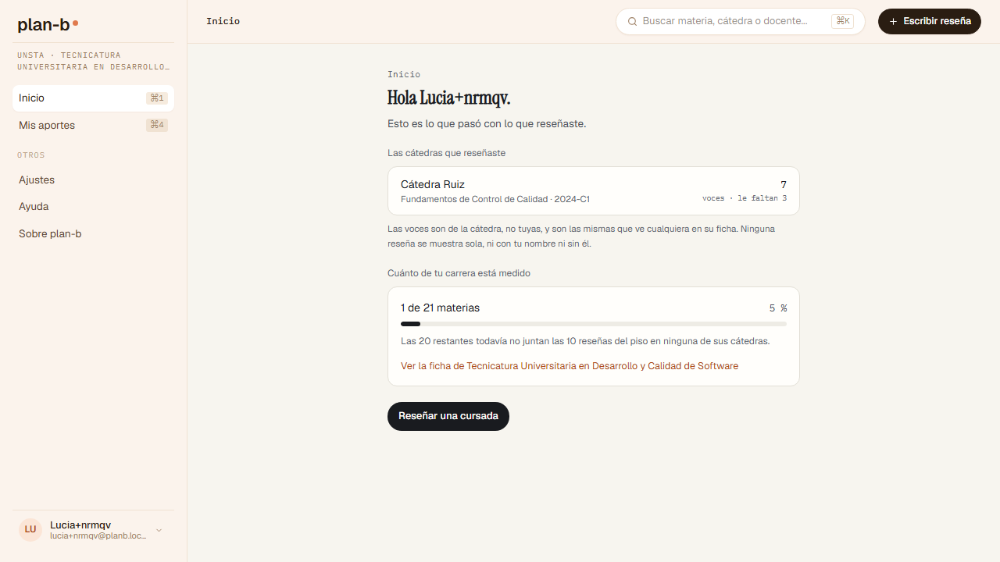
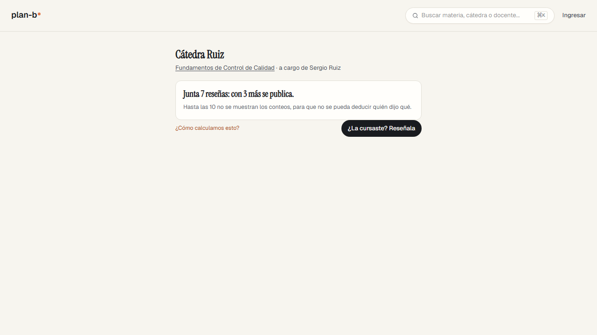
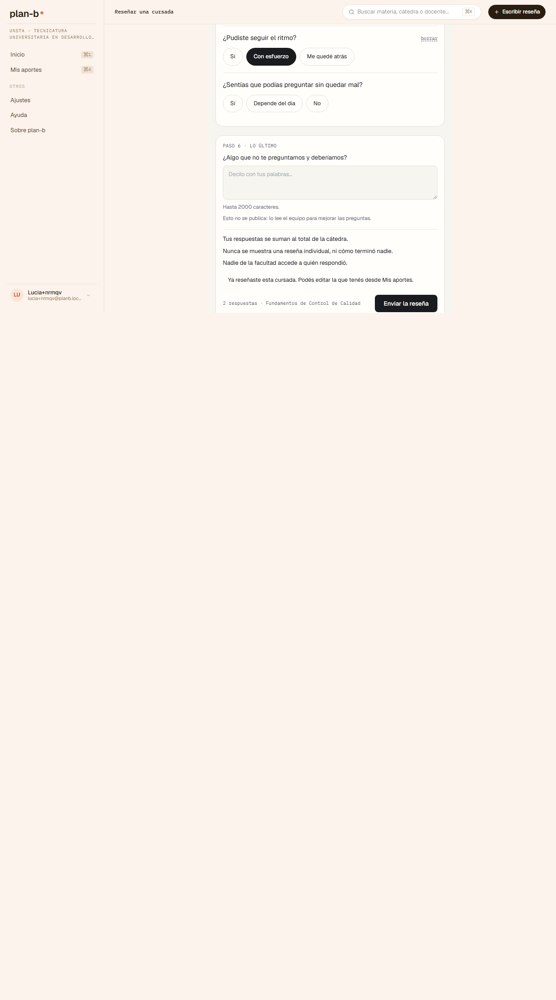
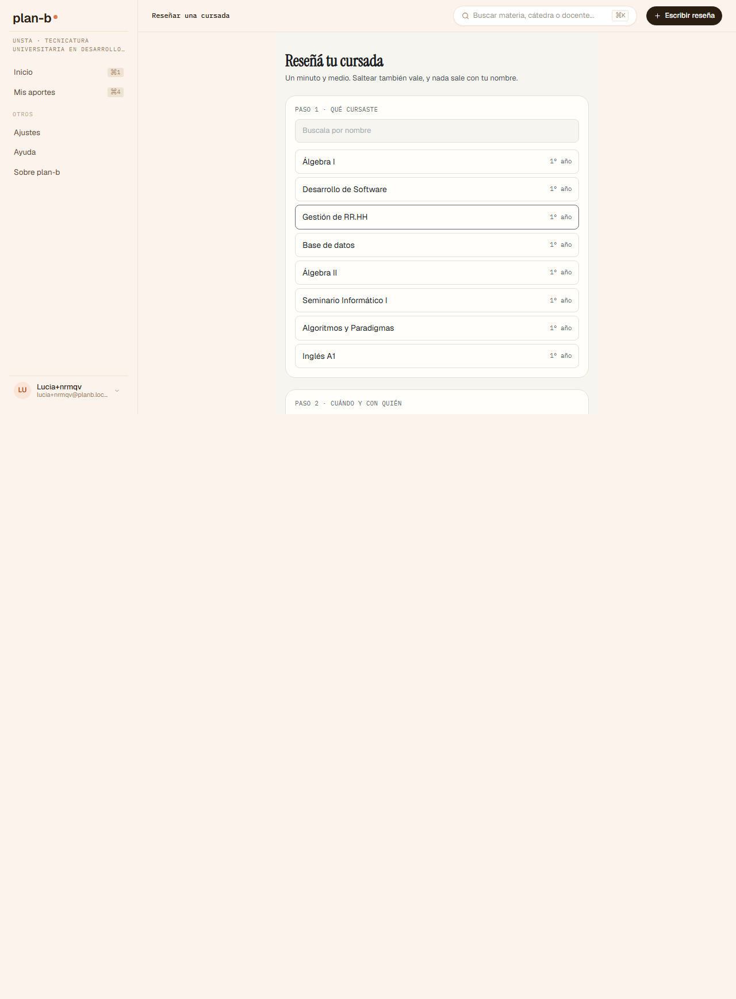
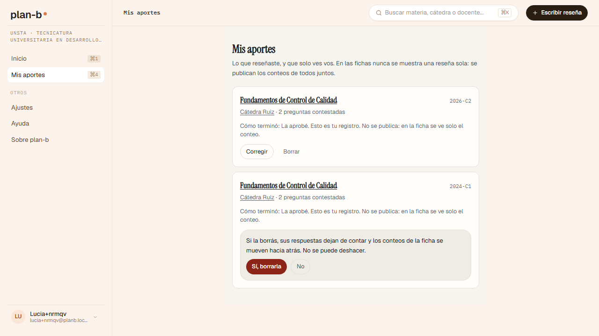

# El recorrido de Lucía: reseñar, ver que contó, deshacer (2026-09-07)

> Registro de revisión ([índice](README.md)). **Alcance**: el acto de reseñar de punta a punta, caminado como [Lucía](../../product/personas.md), la que se anotó en cinco y dejó dos, sobre el mismo código y el mismo corpus sintético que el stage (`main` en `4519831`), levantado en local con la receta del E2E de CI (`scripts/run-e2e.ts --build`, con `PLANB_SEED_CORPUS=1`) porque el registro y la verificación por mail piden credenciales del stage que no pasan por el asistente. Lo único que no cubre es el stage en sí, que ya cubrieron [Valentina](2026-09-07-valentina-walk.md) y los pasos 1 a 4 del recorrido para Copas. **Norma**: la persona, las stories de [Reseñar](../../product/student/write-a-review/README.md), [Entrar](../../product/student/enter/README.md) y [Deshacer](../../product/student/undo/README.md), y las [garantías](../../product/guarantees/README.md). **Método**: prueba manual simulada, inquisitiva, como spec a ciegas ([`frontend/e2e/_stage/lucia.spec.ts`](../../../frontend/e2e/_stage/lucia.spec.ts)) escrita desde la persona y sus stories sin leer el código; el tercero de los cuatro recorridos de persona de R5 ([#471](https://github.com/lucasidev/plan-b/issues/471)). Donde un veredicto de la spec era una falla del arnés y no del producto, la captura lo desmiente y acá se dice como tal.

Estados: **Resuelto** (con el commit o PR), **Cerrado** (una decisión lo cerró), **Pendiente** (espera una decisión de Lucas o entra a un sprint), **Descartado** (con la razón), **Confirmación** (no era hallazgo).

## Qué se encontró, en una línea

Reseñar cuesta lo que la persona pide: una materia, un toque para cómo terminó, una frase y listo en menos de cinco segundos, y la reseña cuenta donde tiene que contar. Lo que falla está en la puerta y en el después: la cuenta no vuelve a lo que estaba haciendo, el contrato no dice el estado del piso, Mis aportes no muestra qué sumó cada frase, no hay reseña a medias que retomar, y al borrar no se pudo comprobar que el conteo bajara.

## El recorrido, paso por paso

Los textos entre comillas son los que la pantalla mostró, copiados por la spec o leídos en las capturas.

| Paso | Story | Qué esperaba Lucía | Qué mostró el producto | Veredicto |
|---|---|---|---|---|
| 1. El gate en la acción | US-168, US-170, US-229 | Que le pidan la cuenta recién al reseñar, con el motivo a la vista | De la ficha de Ruiz, "¿La cursaste? Reseñala" la manda a `/sign-in`: "Entrá a tu cuenta. Ingresá con la cuenta que usaste para registrarte." Ningún motivo | Parcial |
| 2. La cuenta con lo mínimo | US-228, US-229 | Mail, contraseña, si cursa o da clases, la carrera y el consentimiento; verificar desde el mail; volver a la reseña | Pide "Tu email", "Contraseña", "Repetí la contraseña" y la cascada universidad, carrera y plan. No pregunta si cursa o da clases ni muestra consentimiento. Deja en `/sign-up/check-inbox?email=...`; llega "Confirmá tu cuenta en planb" con el link; verificada, entra y aterriza en `/home`, no en la reseña que había empezado | Parcial |
| 3. Reseñar en menos de dos minutos | US-146, US-147, US-154, US-159 | Una sola materia; cómo terminó en un toque; saltear vale; el campo libre avisa que no se publica; el contrato antes de enviar | Una materia, período y cátedra; las cuatro opciones de cómo terminó ("La aprobé"); una sola frase contestada ("Con esfuerzo") y el resto salteado; "¿Algo que no te preguntamos y deberíamos? Esto no se publica: lo lee el equipo para mejorar las preguntas." El contrato: "Tus respuestas se suman al total de la cátedra. Nunca se muestra una reseña individual, ni cómo terminó nadie. Nadie de la facultad accede a quién respondió." Ningún estado del piso. De abrir `/reviews/new` a `/reviews/mine?published=1`: 4,8 segundos | Parcial (el piso) |
| 4. Ver que contó | US-162, US-231 | Qué se movió: en Mis aportes, por frase; en Inicio, sus cátedras y la cobertura; en la ficha, una voz más | Mis aportes: "Fundamentos de Control de Calidad · 2024-C1 · Cátedra Ruiz · 2 preguntas contestadas · Cómo terminó: La aprobé. Esto es tu registro. No se publica: en la ficha se ve solo el conteo." Sin las voces que suma cada frase. Inicio: la fila de Ruiz y "1 de 21 materias". La ficha de Ruiz pasó de "Junta 6 reseñas: con 4 más se publica." a "Junta 7 reseñas: con 3 más se publica." | Parcial (Mis aportes) |
| 5. Editar | US-165 | Cambiar una respuesta desde Mis aportes | Mis aportes ofrece "Corregir" y "Borrar" por aporte. La spec buscó "Editar" y no lo ejerció | Sin ejercer (arnés) |
| 6. La misma materia dos veces | US-163 | El mismo período no cuenta dos veces; otro período sí | Mismo período: el formulario avisa "Ya reseñaste esta cursada. Podés editar la que tenés desde Mis aportes." pero "Enviar la reseña" sigue habilitado; al enviar, Mis aportes no muestra un segundo aporte para 2024-C1. Otro período (2026-C2): se envía y aparece como otro aporte | Parcial |
| 7. Retomar a medias | US-161 | Lo contestado reaparece para retomar | Al volver a `/reviews/new` el formulario arranca vacío; Mis aportes no lista nada a medias | No cumple |
| 8. Borrar | US-165 | Confirmación explícita, y el conteo de la ficha baja | "Si la borrás, sus respuestas dejan de contar y los conteos de la ficha se mueven hacia atrás. No se puede deshacer." con "Sí, borrarla" y "No". Después de confirmar, la ficha de Ruiz siguió en "Junta 8 reseñas: con 2 más se publica." (tenía dos aportes: el del paso 3 y el del otro período) | No verificado |
| 9. Sin cuenta otra vez | US-168 | La ficha se sigue leyendo | La spec no encontró el control de cerrar sesión (buscó un nombre que no es el del bloque de cuenta) y cerró por cookies; la ficha se lee y vuelve a mostrar "Ingresar" | Cumple; el cierre de sesión sin ejercer (arnés) |

## Hallazgos

| ID | Hallazgo | Story | Estado |
|---|---|---|---|
| L01 | El gate no dice el motivo: al llegar a Ingresar desde "Reseñala", la pantalla es la genérica ("Entrá a tu cuenta") y no dice que es para reseñar esa cursada. | US-229 | Pendiente: R6, tarea 12 ([plan](../../plan/status.md)) |
| L02 | El registro no pregunta si cursa o da clases ni muestra el consentimiento informado: pide mail, contraseña y carrera. Ya figura como no construido en los escenarios de la story. | US-228 | Pendiente: Backlog, con las personas reales (US-228) |
| L03 | Después de verificar el mail y entrar, aterriza en Inicio y no vuelve a la reseña que había empezado. | US-229 | Pendiente: R6, tarea 12 |
| L04 | El contrato antes de enviar no dice el estado del piso de esa cátedra ("junta N: con M más se publica"): dice que se suma al total, que nunca se muestra una reseña sola y que nadie de la facultad accede a quién respondió. | US-159 | Pendiente: R6, tarea 13 |
| L05 | Mis aportes muestra cómo terminó y cuántas preguntas contestó, pero no la opción que eligió en cada frase ni las voces que suma ahora. | US-162 | Pendiente: R6, tarea 14 |
| L06 | La reseña duplicada del mismo período se detecta y se avisa, pero el botón de enviar sigue habilitado: la persona puede enviar igual y recién después descubre que no contó. | US-163 | Pendiente: R6, tarea 13 |
| L07 | No existe la reseña a medias: lo contestado se pierde al salir y nada reaparece para retomar. | US-161 | Pendiente: Backlog (US-161) |
| L08 | Tras confirmar el borrado, la ficha de Ruiz siguió mostrando el mismo conteo. No se pudo saber si el borrado no ocurrió (el click de confirmar es un botón de acción, la clase de #477) o si ocurrió y el conteo no bajó: la spec leyó la ficha sin esperar a que el aporte desapareciera de Mis aportes. | US-165 | Pendiente: R6, tarea 15. La clase queda confirmada por [#491](https://github.com/lucasidev/plan-b/issues/491): Corregir y Borrar en Mis aportes navegan con el mismo `router.refresh()` sin fallback duro que #491 midió fallando bajo carga; el fix de esa tarea apaga el prefetch del shell y agrega el fallback a `router.push`, sin cubrir todavía ese `refresh()`. Falta reverificar el conteo sobre el stage |

Confirmaciones (no eran hallazgos): el gate llega en la acción y no en la puerta (US-170); el registro se verifica desde el mail sin pedir nada más; reseñar una materia sola con una sola frase y cómo terminó en un toque, en menos de cinco segundos (US-146, US-147, US-154); saltear vale; el campo libre dice que no se publica; el contrato dice que nunca se muestra una reseña sola y que nadie de la facultad accede a quién respondió; la reseña cuenta en la ficha (6 a 7) y aparece en Inicio con la cobertura de la carrera (US-231); otro período cuenta como otra cursada (US-163); borrar pide confirmación explícita y dice lo que pasa; y sin cuenta la ficha se sigue leyendo (US-168).

Dos pasos quedaron sin ejercer por el arnés y no por el producto: Corregir (existe, la spec buscó "Editar") y cerrar sesión (la spec buscó un nombre que no es el del bloque de cuenta). Se corrigen antes de la próxima corrida.

## Cómo se hizo

La spec corrió el 2026-09-07 a la tarde (hora de Argentina) contra el stack local levantado con `bun scripts/run-e2e.ts --build e2e/_stage/lucia.spec.ts` y `PLANB_SEED_CORPUS=1`: un minuto y un segundo, los nueve pasos, con `expect.soft` en cada aserción y un timeout propio en cada acción para que ningún paso trabe a los demás. La cuenta se creó con un mail inventado y se verificó en el Mailpit local. Las capturas quedan en [`assets/2026-09-07-lucia/`](assets/2026-09-07-lucia/).

## Las capturas

*01-sign-in-gate.png: Ingresar, sin el motivo.*

*02-sign-up-form.png: mail, contraseña y carrera; nada de cursa o da clases ni consentimiento.*

*02-check-inbox.png: la pantalla que manda a revisar el mail.*

*02-landed-after-sign-in.png: después de entrar, Inicio y no la reseña.*

*03-review-contract.png: el campo libre que no se publica y el contrato, sin el estado del piso.*

*04-my-contributions.png: el aporte, con Corregir y Borrar, sin las voces por frase.*

*04-home.png: la cátedra reseñada y la cobertura de la carrera.*

*04-chair-after-review.png: Ruiz pasó a juntar 7.*

*06-duplicate-same-term.png: el aviso de que ya reseñó esa cursada, con el botón de enviar habilitado.*

*07-resume-draft.png: el formulario vacío al volver.*

*08-delete-confirm.png: la confirmación explícita.*

*08-chair-after-delete.png: Ruiz siguió en 8.*
