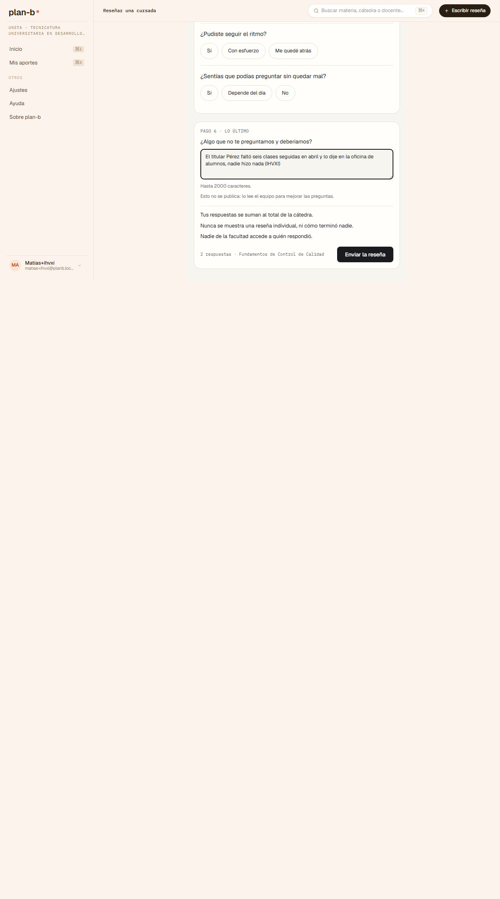
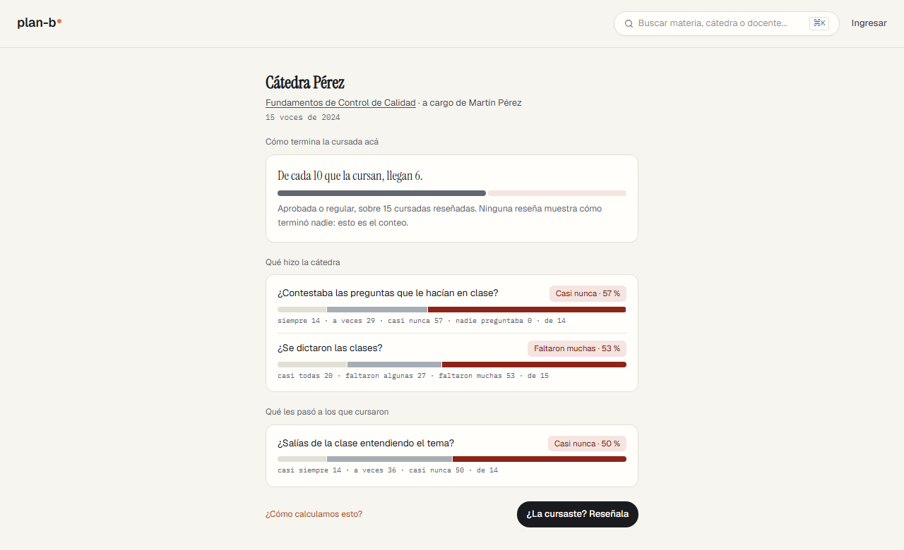
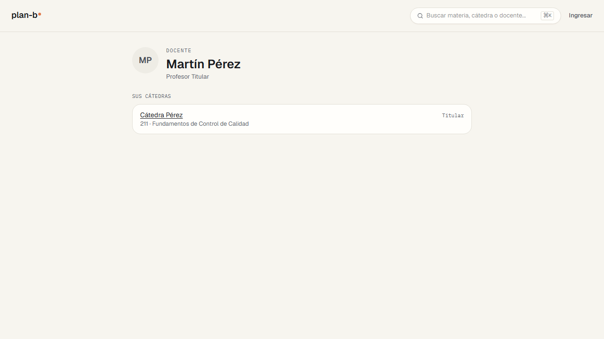
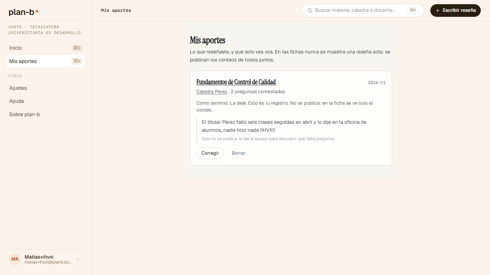
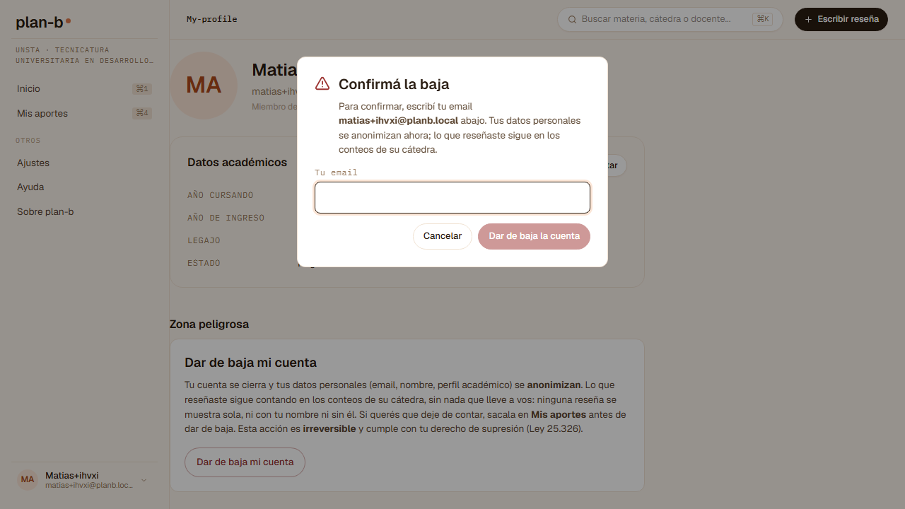

# El recorrido de Matías: decir algo incómodo sin que nadie sepa que fue él (2026-09-07)

> Registro de revisión ([índice](README.md)). **Alcance**: el anonimato en los hechos, caminado como [Matías](../../product/personas.md), el que reclamó solo y no sirvió de nada, sobre el mismo código y el mismo corpus sintético que el stage (`main` en `4519831`), levantado en local con la receta del E2E de CI (`scripts/run-e2e.ts --build`, con `PLANB_SEED_CORPUS=1`), porque el registro por mail pide credenciales del stage que no pasan por el asistente. **Norma**: la persona, las stories US-148, US-159, US-165 y US-166, las [garantías](../../product/guarantees/README.md), [ADR-0084](../../decisions/0084-free-text-feeds-curation-and-is-never-published.md) y lo que la [tesis](../../THESIS.md) dice del anonimato como mecanismo. **Método**: prueba manual simulada, inquisitiva, como spec a ciegas ([`frontend/e2e/_stage/matias.spec.ts`](../../../frontend/e2e/_stage/matias.spec.ts)) escrita desde la persona y sus stories sin leer el código; el cuarto de los cuatro recorridos de persona de R5 ([#471](https://github.com/lucasidev/plan-b/issues/471)). Donde un veredicto de la spec era una falla del arnés, la captura lo desmiente y acá se dice como tal.

Estados: **Resuelto** (con el commit o PR), **Cerrado** (una decisión lo cerró), **Pendiente** (espera una decisión de Lucas o entra a un sprint), **Descartado** (con la razón), **Confirmación** (no era hallazgo).

## Qué se encontró, en una línea

El anonimato se cumple como mecanismo: Matías dijo que faltaron muchas clases y escribió en el campo libre un texto que lo identificaría, la ficha de Pérez sumó su voz (de 14 a 15, "faltaron muchas" de 50 % a 53 %), y ni el texto, ni su nombre, ni su mail aparecen en ninguna pantalla pública ni en el buscador. Lo que falla es lo mismo que para Lucía: la puerta no dice el motivo, el registro no pregunta lo que la story pide, el contrato no dice el piso, y Mis aportes no le muestra lo que marcó. La baja no se pudo ejercer por el arnés.

## El recorrido, paso por paso

| Paso | Story | Qué esperaba Matías | Qué mostró el producto | Veredicto |
|---|---|---|---|---|
| 1. Nada antes de reseñar | US-170, US-228, US-229 | Que le pidan la cuenta recién al reseñar, con el motivo; el registro con lo mínimo; volver a la reseña | Sin cuenta, la ficha de Pérez con "¿La cursaste? Reseñala" y ningún diálogo. El gate manda a `/sign-in` sin motivo. El registro pide mail, contraseña y carrera, sin si cursa o da clases ni consentimiento. Verificado por mail, entra y aterriza en `/home` | Parcial |
| 2. La cursada donde faltaron seis clases | US-146, US-154, US-159, ADR-0084 | Marcar "Faltaron muchas" y "La dejé", escribir en el campo libre con nombre y todo, y el contrato antes de enviar | Contestó "Faltaron muchas" y "La dejé", escribió "El titular Pérez faltó seis clases seguidas en abril y lo dije en la oficina de alumnos, nadie hizo nada (...)". El campo libre avisa que no se publica. El contrato: "Tus respuestas se suman al total de la cátedra. Nunca se muestra una reseña individual, ni cómo terminó nadie. Nadie de la facultad accede a quién respondió." Sin el estado del piso. Enviada: `/reviews/mine?published=1` con el link a "Cátedra Pérez" | Parcial (el piso) |
| 3. Su reseña quedó y suma | US-162, US-231 | Verla en Mis aportes, en Inicio, y una voz más en la ficha | Mis aportes menciona "La dejé" pero no "Faltaron muchas". Inicio: "Cátedra Pérez · Fundamentos de Control de Calidad · 2024-C1 · 15 voces · publica" y "1 de 21 materias". La ficha de Pérez: "¿Se dictaron las clases?" pasó de "Faltaron muchas · 50 %" sobre 14 a "53 %" sobre 15 | Parcial (Mis aportes) |
| 4. Que nadie sepa que fue él | US-148, US-159, tesis | Cero rastro suyo en lo público; nada individual | Buscado el sufijo, su mail, "Matías" y el texto del campo libre en la ficha de Pérez, la materia 211, la entrada, Método, el buscador (`/api/search?q=`, 0 resultados) y la página de Martín Pérez: nada. La ficha muestra solo conteos; ningún puntaje ni nombre de alumno | Cumple |
| 5. El campo libre no se publica | ADR-0084 | Verlo solo él, con el aviso | Aparece en Mis aportes con la nota de que no se publica | Cumple |
| 6. Reportar sin cuenta | US-167 | Rebasada por ADR-0084: no hay texto publicado que reportar | Ningún control de reportar en la ficha | No aplica |
| 7. Sacar lo suyo e irse | US-166 | La pantalla dice qué se anonimiza y qué queda; confirmar; no entrar más; la voz queda; re-registrarse con el mismo mail | Mi perfil, "Zona peligrosa: Dar de baja mi cuenta. Tu cuenta se cierra y tus datos personales (email, nombre, perfil académico) se anonimizan. Lo que reseñaste sigue contando en los conteos de su cátedra, sin nada que lleve a vos (...) Si querés que deje de contar, sacala en Mis aportes antes de dar de baja. Esta acción es irreversible y cumple con tu derecho de supresión (Ley 25.326)." El diálogo "Confirmá la baja" pide escribir el mail para habilitar "Dar de baja la cuenta"; la spec no lo escribió, así que la baja nunca corrió: la sesión siguió viva, el login siguió andando y el re-registro no se pudo probar | Sin ejercer (arnés) |
| 8. Sin cuenta otra vez | US-168, US-148 | La ficha se lee, y sigue sin rastro suyo | La ficha de Pérez se lee, "Ingresar" visible; el sufijo sigue sin aparecer en ningún lado | Cumple |

## Hallazgos

Los de la puerta, el registro, el contrato y Mis aportes son los mismos que L01 a L05 del [recorrido de Lucía](2026-09-07-lucia-walk.md) y no se repiten con otro ID. Matías no dejó hallazgos propios: lo que define a su persona, que su voz cuente y que nadie sepa que fue él, se cumple.

Confirmaciones (no eran hallazgos): la ficha y el botón de reseñar sin cuenta y sin ningún diálogo (US-170); el campo libre avisa que no se publica y solo lo ve él en Mis aportes (ADR-0084); la reseña cuenta en la ficha (14 a 15 voces, "faltaron muchas" de 50 % a 53 %) y aparece en Inicio (US-231); ningún rastro de la persona en ninguna pantalla pública ni en el buscador (US-148, US-159); ningún puntaje ni reseña individual; la pantalla de baja dice qué se anonimiza, qué queda y que es irreversible, y pide escribir el mail para confirmar (US-166); y sin cuenta la ficha se sigue leyendo (US-168).

Un paso quedó sin ejercer por el arnés: la baja (la spec no escribió el mail de confirmación). Se corrige antes de la próxima corrida, que además tiene que verificar que la voz sumada sobreviva a la baja y que el mail se pueda volver a registrar.

## Cómo se hizo

La spec corrió el 2026-09-07 a la tarde (hora de Argentina) contra el stack local levantado con `bun scripts/run-e2e.ts --build e2e/_stage/matias.spec.ts` y `PLANB_SEED_CORPUS=1`: un minuto y doce segundos, los ocho pasos, con `expect.soft` en cada aserción y un timeout propio en cada acción. La cuenta se creó con un mail inventado y se verificó en el Mailpit local. Las capturas quedan en [`assets/2026-09-07-matias/`](assets/2026-09-07-matias/).

## Las capturas

*01-chair-before-account.png: la ficha de Pérez y el botón de reseñar, sin pedir nada.*

*05-review-form-contract.png: el campo libre que no se publica y el contrato, sin el estado del piso.*

*08-chair-after-review.png: 15 voces; "faltaron muchas" al 53 %.*

*09-privacy-search.png: el buscador no devuelve nada suyo.*

*10-my-contributions-free-text.png: Mis aportes muestra su texto con la nota de que no se publica.*

*12-delete-account.png: qué se anonimiza y qué queda, y el mail para confirmar.*
