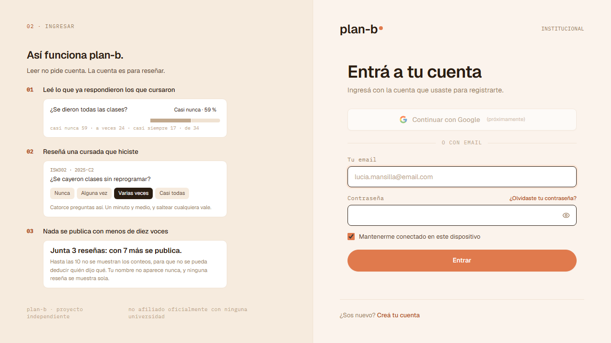
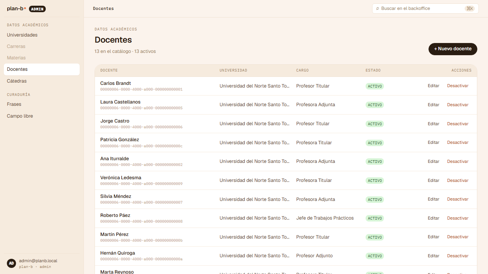
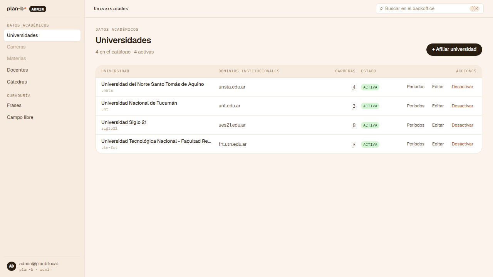
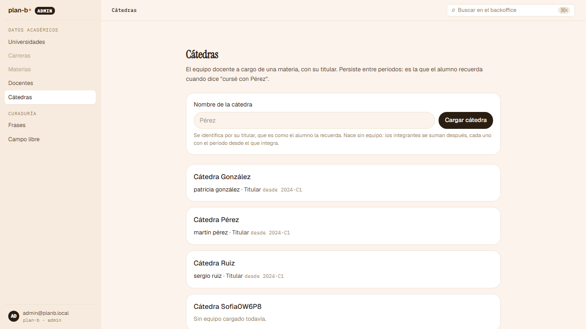
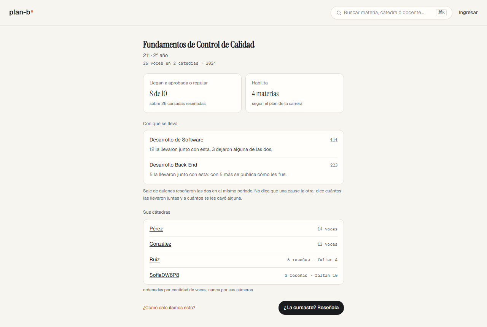
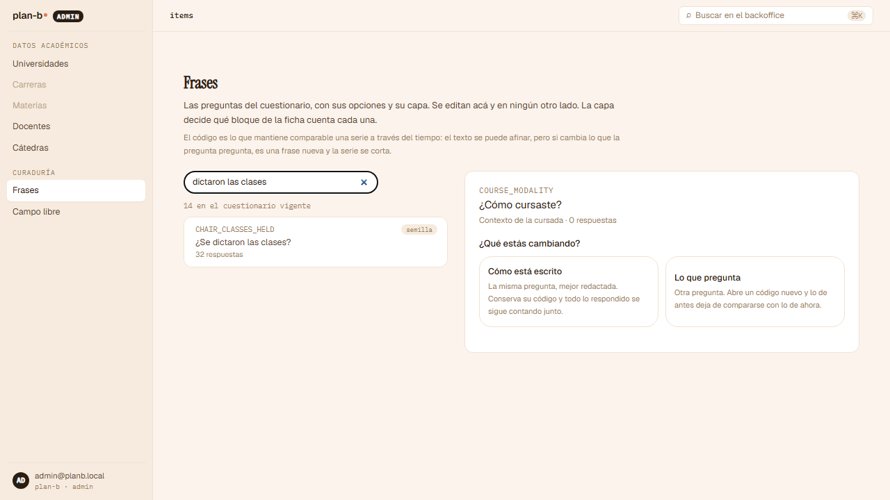
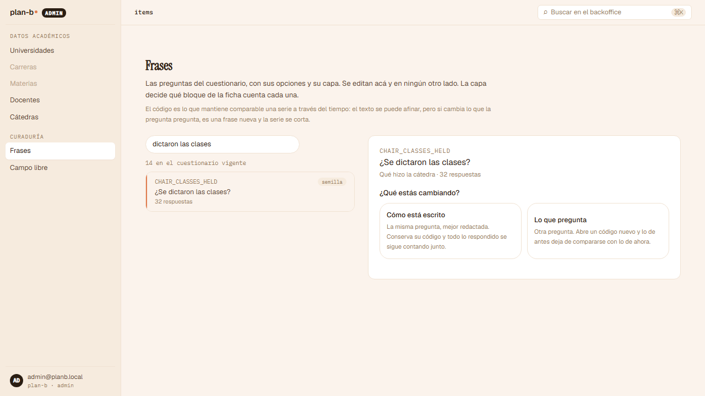
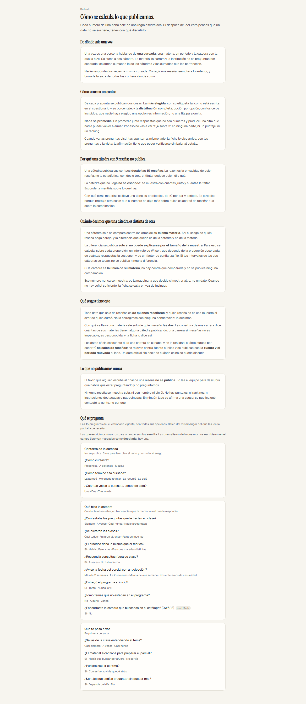
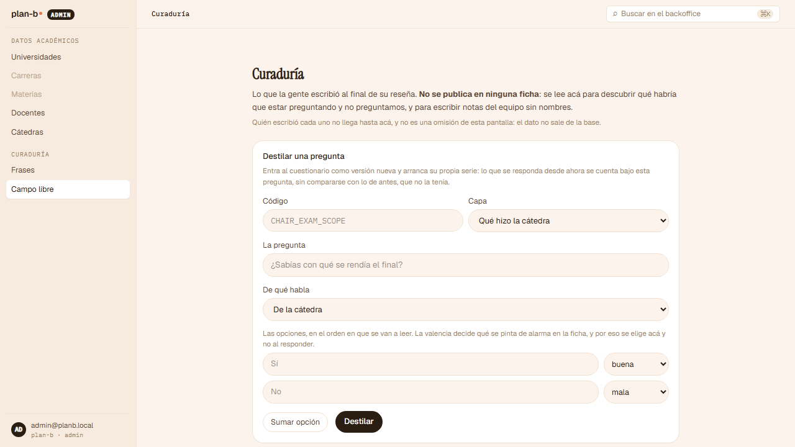
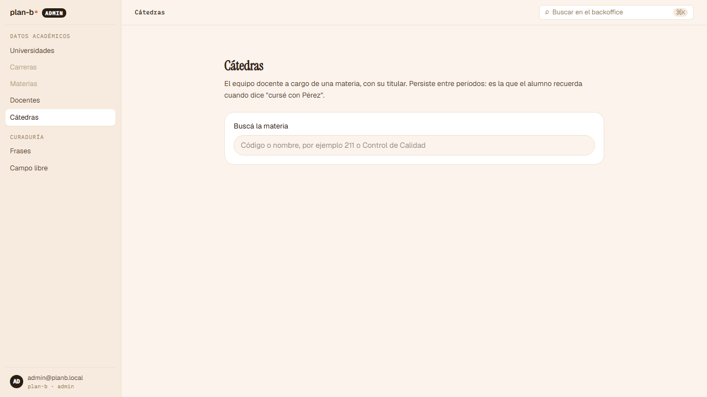

# El recorrido de Sofía sobre el backoffice (2026-09-07)

> Registro de revisión ([índice](README.md)). **Alcance**: el backoffice del producto, caminado como [Sofía](../../product/personas.md), la del equipo que sostiene el catálogo, sobre el mismo código y el mismo corpus sintético que el stage (`main` en `4519831`), levantado en local con la receta del E2E de CI (`scripts/run-e2e.ts --build`, con `PLANB_SEED_CORPUS=1`) porque entrar al backoffice del stage pide credenciales que no pasan por el asistente. Lo único que no cubre es el stage en sí (Dokploy, HTTPS, Traefik), que ya cubrieron [Valentina](2026-09-07-valentina-walk.md) y los pasos 1 a 4 del recorrido para Copas. **Norma**: la persona, las stories de [Sostener el catálogo](../../product/team/sustain-the-catalog/README.md) y de [Cortar los accesos](../../product/team/cut-the-access/README.md), y [ADR-0084](../../decisions/0084-free-text-feeds-curation-and-is-never-published.md). **Método**: prueba manual simulada, inquisitiva, como spec a ciegas ([`frontend/e2e/_stage/sofia.spec.ts`](../../../frontend/e2e/_stage/sofia.spec.ts)) escrita desde la persona y sus stories sin leer el código; el segundo de los cuatro recorridos de persona de R5 ([#471](https://github.com/lucasidev/plan-b/issues/471)). Como el backoffice no se pudo explorar antes de escribir la spec, varios localizadores fueron amplios: donde un "no cumple" de la spec era una falla del arnés, la captura lo desmiente y acá se dice como tal.

Estados: **Resuelto** (con el commit o PR), **Cerrado** (una decisión lo cerró), **Pendiente** (espera una decisión de Lucas o entra a un sprint), **Descartado** (con la razón), **Confirmación** (no era hallazgo).

## Qué se encontró, en una línea

Lo que R3 construyó del catálogo funciona: el corte de acceso, la cátedra como entidad propia, la frase editada en un solo lugar con la distinción entre corregir el texto y cambiar la pregunta, la lectura del campo libre y la destilación a una versión nueva del instrumento. Pero Sofía no puede hacer lo que la define: ver los huecos antes que lo cargado, ordenar la cola por demanda, cargar el equipo docente desde la pantalla, revisar lo destilado antes de ofrecerlo, ni ver quién hizo qué; y seis stories de su épica no existen en el backoffice.

## El recorrido, paso por paso

Los textos entre comillas son los que la pantalla mostró, copiados por la spec.

| Paso | Story | Qué esperaba Sofía | Qué mostró el backoffice | Veredicto |
|---|---|---|---|---|
| 1. El corte de acceso | US-215 | Sin cuenta, nada del backoffice se lee; con la cuenta del equipo, entra | `/admin/universities`, `/admin/chairs`, `/admin/curation` y `/admin/items` redirigen a `/sign-in`. Con `admin@planb.local` aterriza en `/admin/teachers`, con el menú "DATOS ACADÉMICOS: Universidades, Carreras, Materias, Docentes, Cátedras · CURADURÍA: Frases, Campo libre" | Cumple |
| 2. Los huecos antes que lo cargado | US-191, US-192, US-200, US-203 | Una vista de huecos ordenada por lo que bloquea lo publicado y una cola de pedidos ordenada por demanda, con su ritmo | `/admin/universities` es el Catálogo: la lista de universidades. Ninguna vista de huecos, ninguna cola de pedidos | No cumple |
| 3. La cátedra como entidad propia | US-196 | Cargar una cátedra y sumarle el titular desde la pantalla; verla en la lista y en la ficha pública | "Cátedra Sofia0W6P8" cargada desde `/admin/chairs`; en la lista: "Cátedra Sofia0W6P8 · Sin equipo cargado todavía."; ningún formulario ni control para sumar un integrante al equipo docente. Sin cuenta, la ficha de la materia 211 la lista: "Sofia0W6P8 · 0 reseñas · faltan 10" | Parcial |
| 4. Editar la frase en un solo lugar | US-198 | Corregir el texto sin cambiar el significado; un cambio de significado abre un código nuevo con corte de serie | `/admin/items` encuentra "CHAIR_CLASSES_HELD · semilla · ¿Se dictaron las clases? · 32 respuestas" entre las "14 en el cuestionario vigente"; al abrirla pregunta "¿Qué estás cambiando?" con dos caminos: "Cómo está escrito: la misma pregunta, mejor redactada. Conserva su código y todo lo respondido se sigue contando junto." y "Lo que pregunta: otra pregunta. Abre un código nuevo y lo de antes deja de compararse con lo de ahora." La spec no llegó al campo de texto (buscó un label que no existe) y no ejerció el guardado | Cumple (la distinción existe y está explicada); el guardado quedó sin ejercer |
| 5. Curar el campo libre y destilar | US-199, ADR-0084 | Leer el texto libre, destilar una frase a una versión nueva, y una cola de revisión antes de ofrecerla | "Todavía nadie escribió nada. El campo es opcional al reseñar, así que la mayoría de las reseñas no trae texto." La frase `SOFIA_0W6P8` "entró en la versión 2 del cuestionario", aparece en `/admin/items` y en Método como "¿Encontraste la cátedra que buscabas en el catálogo? (0W6P8) destilada". Ninguna cola de revisión: destilar la deja disponible directamente | Parcial |
| 6. Nota editorial sin nombres | ADR-0084 | Escribir una nota a nivel carrera; rechazo si nombra a un docente; publicada con fecha y procedencia | La cabecera de Curaduría dice que el campo libre se lee "para escribir notas del equipo sin nombres" y "Quién escribió cada uno no llega hasta acá". La spec buscó "nota editorial", que no es el texto de la pantalla, y no ejerció la nota | Sin ejercer (arnés) |
| 7. El resto de la épica | US-195, US-194, US-202, US-193, US-204, US-197 | Declarar dos ofertas como la misma carrera; contrastar una corrección contra la fuente; marcar una fuente no oficial; avisar a quienes esperaban; dos planes coexistiendo; vincular materias declaradas | Ningún control ni texto relacionado en el backoffice para ninguna de las seis | No cumple |
| 8. Quién hizo qué | US-216 | Autor y fecha de lo que cargó | Ninguna pantalla muestra autor ni fecha de la cátedra cargada | No cumple |
| 9. Cerrar sesión | US-215 | Cerrar sesión y que `/admin/chairs` vuelva a pedir cuenta | La spec buscó el botón de cuenta por el nombre de la persona y no lo encontró; el control vive en el bloque de cuenta abajo a la izquierda ("admin@planb.local · plan-b · admin") | Sin ejercer (arnés) |

## Hallazgos

| ID | Hallazgo | Story | Estado |
|---|---|---|---|
| S01 | El backoffice no tiene la vista de huecos ni la cola de pedidos: lo que hay es el catálogo para cargar. Sofía no puede ver qué bloquea lo publicado ni priorizar por demanda. | US-191, US-192, US-200, US-203 | Pendiente: Backlog, Pedir una carrera y la cola (US-139 a US-142, US-191, US-192, US-200, US-203) ([plan](../../plan/status.md)) |
| S02 | La cátedra se carga como entidad propia, pero el equipo docente no se carga desde la pantalla: la cátedra queda "Sin equipo cargado todavía" y el titular solo entra por la API. | US-196 | Pendiente: Backlog (US-196) |
| S03 | Destilar una frase la ofrece de inmediato en la versión nueva del cuestionario: no hay cola de revisión antes de ofrecerla. | US-199 | Pendiente: Backlog (US-199), con la decisión abierta |
| S04 | Nada muestra quién cargó qué ni cuándo: el registro existe por módulo pero ninguna pantalla lo lee. | US-216 | Pendiente: Backlog (US-216, US-218) |
| S05 | Seis stories de la épica no existen en el backoffice: la misma carrera en dos ofertas, la corrección contrastada contra la fuente, la fuente no oficial, el aviso a quienes esperaban, la reforma con dos planes, la materia declarada vinculada a la canónica. | US-195, US-194, US-202, US-193, US-204, US-197 | Pendiente: R6, tarea 2 para US-195; el resto al Backlog (US-193, US-194, US-197, US-202, US-204) |
| S06 | Una cátedra recién cargada aparece en la ficha pública de la materia con "0 reseñas · faltan 10" en el mismo momento. Es el estado declarado que Ana pide (el vacío explicado), pero deja visible en el producto una cátedra que el equipo puede estar cargando a medias. | US-196, persona | Pendiente: Backlog, con la decisión abierta |

Confirmaciones (no eran hallazgos): el corte de acceso para quien no tiene cuenta en las cuatro rutas del backoffice (US-215); la cuenta del equipo entra y ve el menú entero; la cátedra se carga y aparece en la lista y en la ficha pública bajo el piso; la frase se busca y al abrirla se explica la diferencia entre corregir el texto (mismo código, misma serie) y cambiar la pregunta (código nuevo, corte de serie), que es exactamente US-198; la curaduría lee el campo libre y explica por qué está vacío; la destilación crea la versión 2 del cuestionario y la frase aparece marcada como destilada en Método y en Frases; y la cabecera de Curaduría dice que las notas del equipo van sin nombres y que quién escribió cada texto no llega hasta ahí (ADR-0084).

Tres pasos quedaron sin ejercer por el arnés y no por el producto (el guardado de la frase, la nota editorial y el cierre de sesión): la spec se escribió sin poder ver el backoffice y buscó textos que la pantalla no usa. Se corrigen antes de la próxima corrida, sobre el stage rellenado ([#469](https://github.com/lucasidev/plan-b/issues/469)).

## Cómo se hizo

La spec corrió el 2026-09-07 a las 17:08 (hora de Argentina) contra el stack local levantado con `bun scripts/run-e2e.ts --build e2e/_stage/sofia.spec.ts` y `PLANB_SEED_CORPUS=1`: un minuto y doce segundos, los nueve pasos, con `expect.soft` en cada aserción para que el recorrido siga y cada paso quede con su veredicto. Las credenciales fueron las sembradas en local; el Mailpit, el local. Las capturas quedan en [`assets/2026-09-07-sofia/`](assets/2026-09-07-sofia/).

## Las capturas

*01-access-cut-anonymous.png: las cuatro rutas del backoffice mandan a Ingresar.*

*01-access-cut-admin.png: la cuenta del equipo aterriza en Docentes, con el menú entero.*

*02-gaps-and-queue.png: el Catálogo, sin vista de huecos ni cola de pedidos.*

*03-chair-created.png: la cátedra nueva en la lista de la materia.*

*03-chair-team.png: "Sin equipo cargado todavía", y ningún control para cargarlo.*

*03-chair-public.png: la materia 211 la lista con "0 reseñas · faltan 10".*

*04-edit-phrase-search.png: la frase en el catálogo, con su código y sus respuestas.*

*04-edit-phrase-form.png: corregir el texto o cambiar la pregunta, explicado.*

*05-curation-free-text.png: la curaduría explica por qué no hay texto libre.*

*05-curation-distill.png: la frase nueva entró en la versión 2 y Método la marca como destilada.*

*06-editorial-note-entry.png: la cabecera anuncia las notas del equipo sin nombres; la spec no llegó a escribir una.*

*07-epic-scope.png: el catálogo, sin ninguna de las seis stories restantes.*

*08-authorship.png: la cátedra cargada, sin quién ni cuándo.*

*09-sign-out.png: la sesión del equipo, con el bloque de cuenta abajo a la izquierda.*
