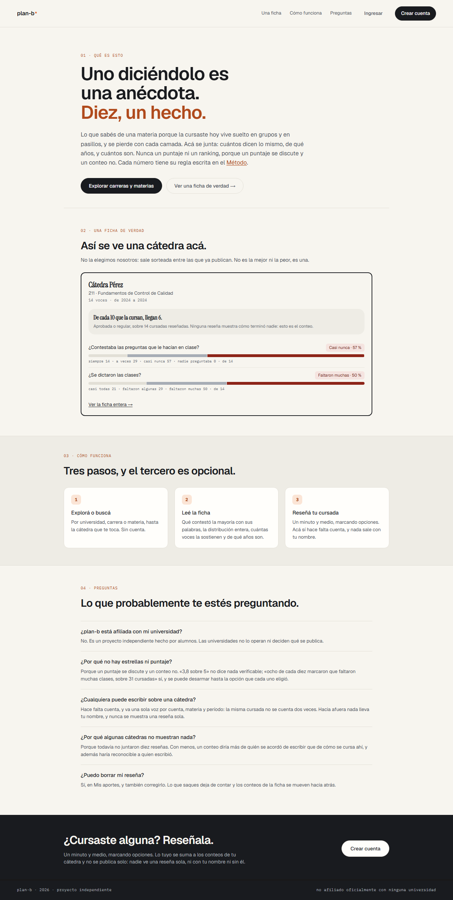
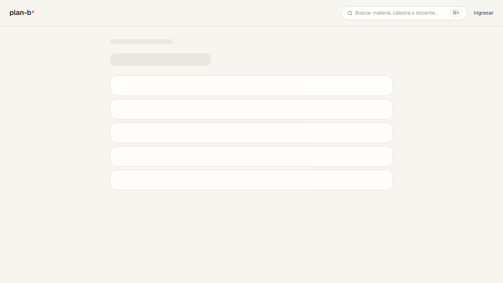
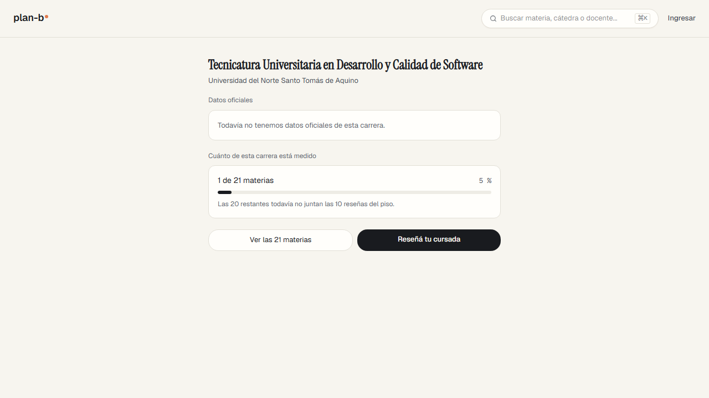
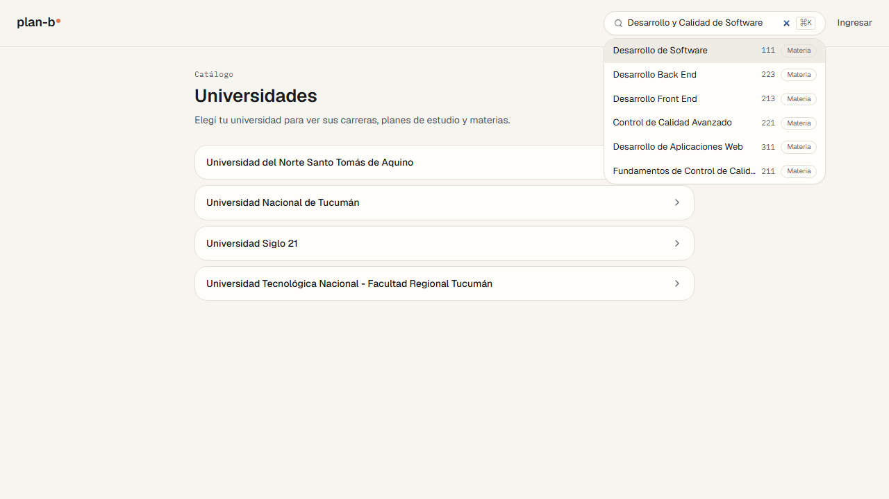
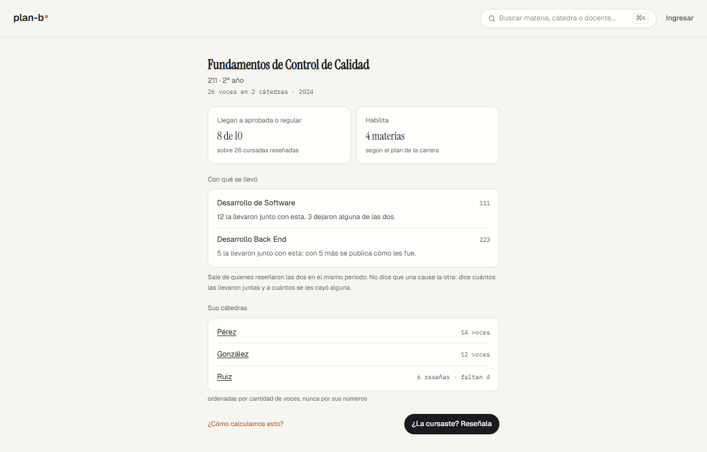
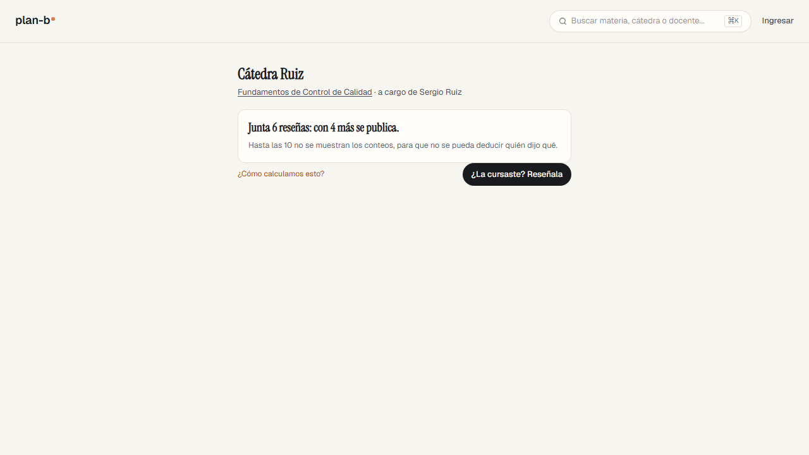
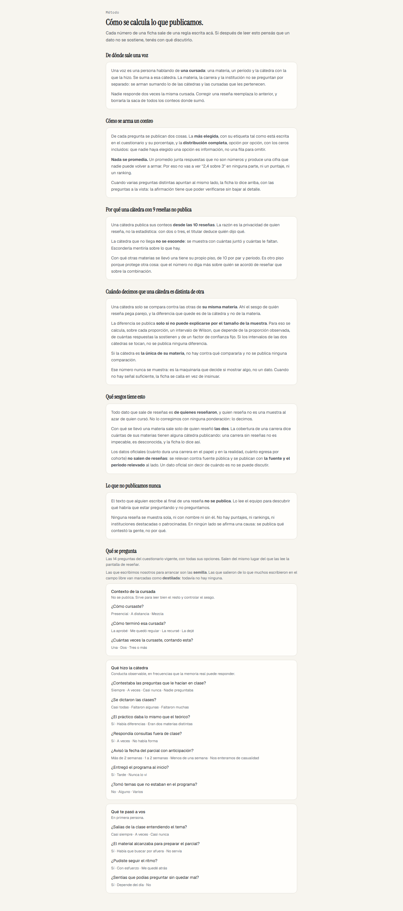
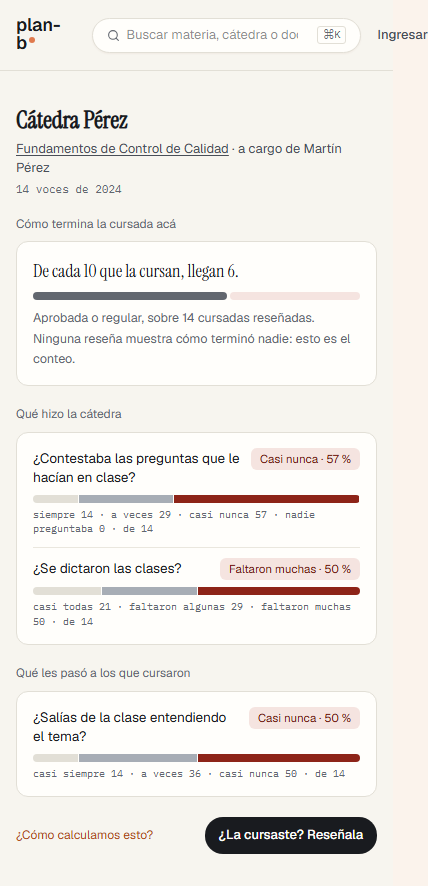
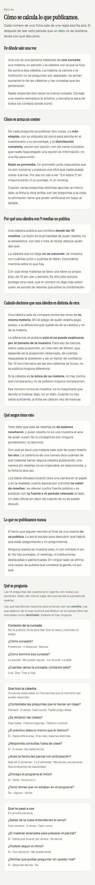

# El recorrido de Valentina sobre el stage (2026-09-07)

> Registro de revisión ([índice](README.md)). **Alcance**: el stage tal como estaba el 2026-09-07 (`main` en `4519831`, corpus sintético de una materia con tres cátedras), caminado como [Valentina](../../product/personas.md), la que tiene que decidir cinco años con un folleto, sin cuenta. **Norma**: la persona, las stories de [Elegir dónde estudiar](../../product/student/choose-where-to-study/README.md) y de [Llevarse el dato](../../product/student/take-the-data/README.md), las [garantías](../../product/guarantees/README.md) y las restricciones del producto, y el [Método](../../THESIS.md). **Método**: prueba manual simulada, inquisitiva. Cada paso pregunta si el recorrido se cumple de verdad; un paso que el producto no cumple queda como no cumple, y la spec a ciegas que lo repite ([`frontend/e2e/_stage/valentina.spec.ts`](../../../frontend/e2e/_stage/valentina.spec.ts)) no se acomoda al código: sus aserciones son lo que Valentina espera. Es el primero de los cuatro recorridos de persona de R5 ([#471](https://github.com/lucasidev/plan-b/issues/471)), hecho antes de rellenar el stage: lo que dependa del corpus se dice como tal.

Estados: **Resuelto** (con el commit o PR), **Cerrado** (una decisión lo cerró), **Pendiente** (espera una decisión de Lucas o entra a un sprint), **Descartado** (con la razón), **Confirmación** (no era hallazgo).

## Qué se encontró, en una línea

La lectura sin cuenta se cumple entera y la ficha de cátedra dice lo que la tesis promete (moda, distribución, voces, años, piso explicado, ningún puntaje), pero Valentina no puede hacer lo que la trae: elegir dónde estudiar. No hay datos oficiales, no hay Dónde estudiarla, el buscador no encuentra carreras, la exploración tiene una sola lente, y desde la ficha no se llega ni al docente ni a un CSV. En celular, la ficha de cátedra desborda por el buscador del header.

## El recorrido, paso por paso

Los textos entre comillas son los que el stage mostró, copiados.

| Paso | Story | Qué esperaba Valentina | Qué mostró el stage | Veredicto |
|---|---|---|---|---|
| 1. Llegar a `/` | US-221, US-168, US-170, US-171 | Una ficha real, ningún puntaje, nada que pedir antes de leer, nada vendido | "Uno diciéndolo es una anécdota. Diez, un hecho." Una ficha sorteada (Pérez o González según la carga), "14 voces · de 2024 a 2024", "De cada 10 que la cursan, llegan 6.", dos frases con moda y distribución. "Nunca un puntaje ni un ranking". Sin modal, sin banner, sin "patrocinado"; "Crear cuenta" está pero no se exige. Caminos: "Explorar carreras y materias" y "Ver una ficha de verdad". No hay buscador en la entrada | Cumple |
| 2. Explorar | US-222 | Llegar a una carrera sin saber qué buscar, con las dos lentes de la ficha de pantalla | `/universities`: "Elegí tu universidad para ver sus carreras, planes de estudio y materias." Cuatro universidades; UNSTA lista cuatro carreras. Una sola lente, por universidad; ninguna por carrera | Parcial |
| 3. Ficha de carrera | US-127, US-133, US-134, US-129 | Dura en el papel y en la realidad, egreso por cohorte, con fuente y período; la cobertura; qué frena | "Datos oficiales: Todavía no tenemos datos oficiales de esta carrera." "Cuánto de esta carrera está medido: 1 de 21 materias, 5 %. Las 20 restantes todavía no juntan las 10 reseñas del piso." Botones "Ver las 21 materias" y "Reseñá tu cursada". Ningún dato oficial, ningún "qué frena" | No cumple (declarado) |
| 4. Dónde estudiarla | US-128 | Un camino desde la carrera a la misma carrera en otras instituciones, lado a lado, sin ganador | No existe ningún link, sección ni botón | No cumple |
| 5. Buscar | US-132 | Encontrar por materia, carrera o docente | El buscador vive en el catálogo, no en la entrada, y su placeholder dice "Buscar materia, cátedra o docente...". "Desarrollo y Calidad de Software" (la carrera) devuelve solo materias (Desarrollo de Software, Desarrollo Back End, Desarrollo Front End, Control de Calidad Avanzado, Desarrollo de Aplicaciones Web, Fundamentos de Control de Calidad); "Pérez" devuelve al docente Martín Pérez, la Cátedra Pérez y a Roberto Páez; "Fundamentos" devuelve la materia 211 | Parcial |
| 6. Ficha de materia 211 | US-131, US-134, US-143, US-138 | Cuántas voces y de qué años, la cobertura, la co-cursada, las cátedras con su estado | "26 voces en 2 cátedras · 2024". "Llegan a aprobada o regular: 8 de 10, sobre 26 cursadas reseñadas". "Habilita 4 materias según el plan de la carrera". "Desarrollo de Software: 12 la llevaron junto con esta. 3 dejaron alguna de las dos." "Desarrollo Back End: 5 la llevaron junto con esta: con 5 más se publica cómo les fue." "Sale de quienes reseñaron las dos en el mismo período. No dice que una cause la otra." Cátedras: "Pérez 14 voces", "González 12 voces", "Ruiz 6 reseñas · faltan 4", "ordenadas por cantidad de voces, nunca por sus números". Link "¿Cómo calculamos esto?" | Cumple |
| 7. Ficha de Cátedra Pérez | US-130, US-131, US-138 | La fama por convergencia arriba, en dos segundos; cada frase con moda, distribución y voces; los dos bloques; la tasa de finalización con su denominador; comparación solo contra hermanas; ningún puntaje | "14 voces de 2024". "De cada 10 que la cursan, llegan 6. Aprobada o regular, sobre 14 cursadas reseñadas. Ninguna reseña muestra cómo terminó nadie." Bloque "Qué hizo la cátedra": "¿Contestaba las preguntas que le hacían en clase? Casi nunca · 57 %: siempre 14 · a veces 29 · casi nunca 57 · nadie preguntaba 0 · de 14"; "¿Se dictaron las clases? Faltaron muchas · 50 %: casi todas 21 · faltaron algunas 29 · faltaron muchas 50 · de 14". Bloque "Qué les pasó a los que cursaron": "¿Salías de la clase entendiendo el tema? Casi nunca · 50 %: casi siempre 14 · a veces 36 · casi nunca 50 · de 14". Ningún puntaje. Arriba no hay ninguna línea de fama por convergencia aunque las tres frases apuntan al mismo lado. Ninguna comparación contra González. Tres frases publicadas de las catorce del cuestionario | Parcial |
| 8. Ficha de Cátedra Ruiz | US-136 | Entender por qué no publica | "Junta 6 reseñas: con 4 más se publica. Hasta las 10 no se muestran los conteos, para que no se pueda deducir quién dijo qué." | Cumple |
| 9. Docente | SC-035 | Del nombre en la ficha a la página del docente | "a cargo de Martín Pérez" es texto, no link. Los únicos links de la ficha: la materia, Método y Reseñala. El buscador sí encuentra al docente | No cumple |
| 10. Método | US-130, US-183, US-182, US-184, US-185, US-180 | La regla de cada conteo, el piso y por qué, la comparación entre hermanas, el catálogo con las destiladas, los sesgos, la postura, y el CSV sin cuenta | "De dónde sale una voz", "Cómo se arma un conteo" (moda y distribución con los ceros; "Nada se promedia"), "Por qué una cátedra con 9 reseñas no publica" (privacidad; el piso de la co-cursada, "10 por par y período"), "Cuándo decimos que una cátedra es distinta de otra" (solo hermanas; intervalo de Wilson; "cuando no hay señal suficiente, la ficha se calla"), "Qué sesgos tiene esto" (quien reseña no es muestra al azar; cobertura; los datos oficiales "se relevan contra fuente pública y se publican con la fuente y el período"), "Lo que no publicamos nunca" (texto libre, reseña sola, puntajes, patrocinio, causas), "Qué se pregunta" (las 14 frases con opciones; "destilada: todavía no hay ninguna"). Ningún link ni botón de descarga | Parcial |
| 11. Reportar sin cuenta | US-167 | Una forma de reportar contenido desde la ficha | Ninguna | No cumple |
| 12. En celular | restricción de accesibilidad y celular | Fichas y Método sin scroll horizontal en un celular chico | La spec, a 393 px: la ficha de Pérez desborda (`scrollWidth` 428 sobre `innerWidth` 393, el buscador del header), Método no (393 sobre 393). La medición a mano a 375 px (sin desborde) salió de un panel oculto que no pintaba, y no vale | Parcial |

Dos observaciones de camino: "Ver las 21 materias" en la ficha de carrera lleva a "Planes de estudio" (un solo plan, 2018, vigente) y recién ahí a las materias; y la lista del plan muestra las 21 materias por año y cuatrimestre sin marcar cuál tiene ficha, así que la única medida (1 de 21) hay que encontrarla entrando a cada una.

## Hallazgos

| ID | Hallazgo | Story | Estado |
|---|---|---|---|
| V01 | La ficha de carrera no tiene datos oficiales (duración en el papel y en la realidad, egreso por cohorte) ni "qué frena"; lo declara con "Todavía no tenemos datos oficiales de esta carrera." No hay entidad ni tabla para eso. | US-127, US-133, US-129 | Pendiente: R6 construye el modelo y la ficha con los datos (decidido el 2026-09-07); la pista 3 de R5 releva cada dato con fuente, formato y muestra |
| V02 | Dónde estudiarla no existe: ningún camino desde la carrera a la misma carrera en otras instituciones. | US-128 | Pendiente: R6 (decidido el 2026-09-07), con el relevamiento de V01 |
| V03 | Explorar tiene una sola lente, por universidad, y `/careers` y `/subjects` responden 404. Valentina no tiene universidad: tiene, a lo sumo, una carrera. | US-222 | Pendiente: decisión de Lucas (una lente por carrera, o la búsqueda de V04 la cubre) |
| V04 | El buscador no devuelve carreras ni universidades; su placeholder lo dice. Buscar la carrera que uno quiere estudiar devuelve materias. | US-132 | Pendiente: R6, junto con la ficha de carrera y Dónde estudiarla (decidido el 2026-09-07) |
| V05 | Arriba de la ficha de Pérez no hay fama por convergencia aunque sus tres frases apuntan al mismo lado, y Método dice que "la ficha lo dice arriba, con las preguntas a la vista". No se sabe desde afuera si la regla pide más frases o si no está construido. | US-221, persona | Pendiente: verificar sobre el stage rellenado ([#469](https://github.com/lucasidev/plan-b/issues/469)) y, si no aparece, es un hueco |
| V06 | El nombre del docente en la ficha de cátedra es texto sin link; la página del docente solo se alcanza desde el buscador. | SC-035, US-132 | Pendiente |
| V07 | No hay forma de reportar contenido desde una ficha, con cuenta o sin ella. | US-167 | Pendiente |
| V08 | Método no tiene descarga: no hay CSV del crudo. | US-180 | Pendiente |
| V09 | El corpus sintético contesta tres de las catorce frases del cuestionario: la ficha de Pérez publica tres frases y la convergencia (V05) y la comparación entre hermanas no tienen con qué mostrarse. | corpus | Pendiente: [#469](https://github.com/lucasidev/plan-b/issues/469) |
| V10 | La lista de materias del plan no marca cuáles tienen ficha; la cobertura "1 de 21" de la carrera no se puede ubicar sin entrar materia por materia. | US-134, US-138 | Pendiente |
| V11 | "Ver las 21 materias" lleva a los planes de estudio y no a las materias: un paso más cuando hay un solo plan. | US-222 | Pendiente (menor) |
| V12 | La comparación contra las cátedras hermanas no se observa en Pérez ni en González; no se puede distinguir si los intervalos se tocan o si no está construida. | US-129, Método | Pendiente: verificar sobre el stage rellenado ([#469](https://github.com/lucasidev/plan-b/issues/469)) |
| V13 | En un celular de 393 px la ficha de cátedra desborda 35 px hacia el costado: el buscador del header es más ancho que la pantalla. Método no desborda. | restricción de accesibilidad y celular | Pendiente |
| V14 | Método no dice la postura de no tener acuerdos con instituciones; la palabra "acuerdo" no aparece. Lo más cercano es "ni instituciones destacadas o patrocinadas", y la respuesta de la entrada ("Las universidades no lo operan ni deciden qué se publica") no está en la pantalla que es dueña de esa story. | US-185 | Pendiente |

Confirmaciones (no eran hallazgos): la lectura entera sin cuenta y sin que nada se pida antes (US-168, US-170); ningún puntaje, promedio, estrella, ranking ni patrocinio en ninguna pantalla recorrida (US-171, tesis); la ficha bajo el piso explica el piso y por qué (US-136); moda, distribución con ceros, voces y años en cada frase (US-130, US-131); la co-cursada con sus dos pisos y su aclaración de que no afirma causa (US-143, US-184); la tasa de finalización agregada con denominador y la aclaración de que nadie ve cómo terminó nadie; Método cubre la regla, el piso, Wilson, los sesgos, la postura y el catálogo con la marca de destilada; y Método en celular no tiene scroll horizontal.

## Cómo se hizo

A mano, sobre `https://planb.olisar.com.ar` el 2026-09-07 entre las 14:30 y las 15:30 (hora de Argentina), con el navegador integrado del asistente y la lectura del DOM de cada pantalla (`textContent`, los `href` de cada link, `scrollWidth` en celular) y del buscador por su endpoint (`/api/search?q=`). Los tiempos de carga que se midieron no dicen nada del stage: el panel estaba oculto y el navegador no pintaba. Las capturas las produce la spec a ciegas, que repite el recorrido con `expect.soft` en cada paso y las guarda en [`assets/2026-09-07-valentina/`](assets/2026-09-07-valentina/); se corre con `PLAYWRIGHT_INCLUDE_STAGE=1` contra el stage y nunca en CI.

## Capturas y veredictos de la spec

La spec corrió dos veces contra el stage el 2026-09-07 (entre las 15:26 y las 15:31, hora de Argentina), 49 segundos la corrida entera, sin nada lento ni en blanco. Sus 36 veredictos coinciden con el recorrido a mano salvo en tres puntos, que ya están arriba: el desborde en celular (V13), la postura de no tener acuerdos (V14) y los 404 de `/careers` y `/subjects` (V03). En el paso 7 la spec marcó como cumplida la fama por convergencia tomando "De cada 10 que la cursan, llegan 6" como la síntesis de dos segundos; este registro sostiene V05, porque Método promete algo más preciso ("la ficha lo dice arriba, con las preguntas a la vista") y ningún texto de la ficha conecta las tres frases.

| Paso | Story | Qué esperaba Valentina | Qué mostró el stage | Veredicto | Captura |
|---|---|---|---|---|---|
| 1 | US-221 | Al llegar, sin cuenta, una ficha de cátedra real (sorteada) con voces y porcentajes. | Muestra "Cátedra Pérez", "14 voces · de 2024 a 2024" | cumple | 01-landing.png |
| 1 | US-221 | Ningún puntaje, promedio, estrella ni ranking numérico atado a una cátedra o carrera. | No aparecen estrellas ni patrones "X/5". La única mención de "puntaje"/"ranking" es la FAQ explicando por qué no se usan: "Nunca un puntaje ni un ranking, porque un puntaje se discute y un conteo no." | cumple | 01-landing.png |
| 1 | US-171 | Nada de "patrocinado", "destacado" ni "sponsor" en la entrada. | No aparece ninguna mención de patrocinio, lugar destacado ni sponsor. | cumple | 01-landing.png |
| 1 | US-170 | Ningún modal, banner de cookies ni pedido de cuenta antes de leer. | Diálogos abiertos al cargar: 0. Menciona "cookie": no. | cumple | 01-landing.png |
| 1 | US-168 / US-170 | Un camino para explorar y otro para buscar, los dos sin pedir cuenta. | "Explorar carreras y materias" llevó a https://planb.olisar.com.ar/universities. Ahí aparece el buscador (placeholder: "Buscar materia, cátedra o docente...") y sigue visible "Ingresar": no hubo pedido de cuenta en el camino. | cumple | 01-landing.png |
| 2 | US-222 | La ficha de la épica habla de "dos lentes" para explorar: por universidad y por carrera. | Solo existe la lente por universidad (Universidades -> Carreras de esa universidad). Las rutas directas "/careers" y "/subjects" devuelven 404 y 404: no hay una segunda lente por carrera sin pasar antes por una institución. | parcial | 02-explore-university.png |
| 3 | US-127 | Cuánto tarda de verdad la carrera: "dura en el papel" y "dura en la realidad", datos oficiales con fuente y período. | La ficha declara: "Todavía no tenemos datos oficiales de esta carrera." | no cumple | 03-career-fiche.png |
| 3 | US-133 | Saber si la carrera termina en un título: egreso por cohorte, dato oficial. | La ficha declara: "Todavía no tenemos datos oficiales de esta carrera." (mismo bloque "Datos oficiales" que la duración). | no cumple | 03-career-fiche.png |
| 3 | US-134 | La cobertura detrás de la ficha: cuántas materias tienen algo medido, y qué pasa con las que no. | "Cuánto de esta carrera está medido": "1 de 21 materias". Las 20 restantes todavía no juntan las 10 reseñas del piso. | cumple | 03-career-fiche.png |
| 3 | US-129 | Que la dificultad se atribuya a la carrera puntual, y no a la institución en general. | Cada dato que aparece está etiquetado sobre esta carrera puntual ("Cuánto de esta carrera está medido", "1 de 21 materias"), nunca sobre "la universidad" de manera genérica. Todavía no hay datos de dificultad para atribuir en esta carrera (recién 1 de 21 materias). | cumple | 03-career-fiche.png |
| 4 | US-128 | Desde la ficha de carrera, un camino para compararla lado a lado entre instituciones, con datos medidos igual y sin ganador. | No existe ningún link, sección ni botón de comparación en la ficha de carrera. | no cumple | 04-compare-where.png |
| 5 | US-132 | Buscar "Fundamentos de Control de Calidad" (materia) devuelve esa materia. | Fundamentos de Control de Calidad211MateriaControl de Calidad Avanzado221Materia | cumple | 05-search.png |
| 5 | US-132 | Buscar "Pérez" (docente o cátedra) devuelve algún resultado de esos tipos. | Martín PérezProfesor TitularDocentePérezFundamentos de Control de CalidadCátedraRoberto PáezJefe de Trabajos PrácticosDocente | cumple | 05-search.png |
| 5 | US-132 | Buscar "Desarrollo y Calidad de Software" (carrera) devuelve la carrera. | Devuelve: "Desarrollo de Software111MateriaDesarrollo Back End223MateriaDesarrollo Front End213MateriaControl de Calidad Avanzado221MateriaDesarrollo de Aplicaciones Web311MateriaFundamentos de Control de Calidad211Materia" (todos etiquetados "Materia"; ninguno "Carrera"). | no cumple | 05-search.png |
| 5 | US-132 | El placeholder del buscador dice qué se puede buscar. | placeholder="Buscar materia, cátedra o docente..." | cumple | 05-search.png |
| 6 | US-131 | Tres cátedras con su estado: Pérez publica con 14 voces, González con 12, Ruiz junta 6 y le faltan 4. | "Pérez14 voces" · "González12 voces" · "Ruiz6 reseñas · faltan 4" | cumple | 06-subject-fiche.png |
| 6 | US-134 | Sobre cuántas voces se calcula la materia, y su cobertura. | "26 voces en 2 cátedras · 2024". La palabra "cobertura" no aparece en esta ficha (a diferencia de la ficha de carrera, que sí la nombra): lo que hay es esa línea, con en cuántas cátedras hay datos. | parcial | 06-subject-fiche.png |
| 6 | US-143 | Con qué materias se puede llevar junta (co-cursada), con sus números reales. | Desarrollo de Software: "12 la llevaron junto con esta. 3 dejaron alguna de las dos.". Desarrollo Back End: "5 la llevaron junto con esta: con 5 más se publica cómo les fue." | cumple | 06-subject-fiche.png |
| 6 | US-138 | Entender por qué un dato aparece en esta ficha (co-cursada) y en otras cátedras no. | "Sale de quienes reseñaron las dos en el mismo período. No dice que una cause la otra: dice cuántos las llevaron juntas y a cuántos se les cayó alguna." La propia fila de Ruiz ya avisa "faltan 4" al lado de las dos que sí publican, así que no hace falta adivinar por qué a Ruiz no le aparece nada. | cumple | 06-subject-fiche.png |
| 7 | US-130 | Arriba de la ficha, en dos segundos: la fama por convergencia (nunca un puntaje). | Justo debajo del título aparece "Cómo termina la cursada acá" con "De cada 10 que la cursan, llegan 6." y una barra visual. No usa la palabra "fama": es el resumen que se lee primero, después del título. | cumple | 07-chair-publishing.png |
| 7 | US-130 / US-131 | Por cada frase: la opción más marcada con su porcentaje, y la distribución entera con el total de voces. | "¿Contestaba las preguntas que le hacían en clase?" -> Casi nunca · 57 % (siempre 14 · a veces 29 · casi nunca 57 · nadie preguntaba 0 · de 14). "¿Se dictaron las clases?" -> Faltaron muchas · 50 % (casi todas 21 · faltaron algunas 29 · faltaron muchas 50 · de 14) | cumple | 07-chair-publishing.png |
| 7 | US-130 | Dos bloques separados ("qué hizo la cátedra" / "qué pasó"), sin sumarse en un solo número. | Aparecen como títulos de sección separados: "Qué hizo la cátedra" y "Qué les pasó a los que cursaron", cada uno con sus propias frases. | cumple | 07-chair-publishing.png |
| 7 | US-130 | La tasa de finalización agregada ("de cada 10 que la cursan, llegan N") con su denominador. | "De cada 10 que la cursan, llegan 6." Aprobada o regular, sobre 14 cursadas reseñadas. Ninguna reseña muestra cómo terminó nadie: esto es el conteo. | cumple | 07-chair-publishing.png |
| 7 | US-130 | Si aparece una comparación, es solo contra las cátedras hermanas (misma materia). | No aparece ninguna comparación con otras cátedras en esta ficha. El Método explica que esa comparación es condicional (solo se publica si los intervalos de Wilson no se tocan): no se puede afirmar desde acá si esta es la razón puntual. | cumple | 07-chair-publishing.png |
| 7 | US-130 | Un link a Método desde cada número o desde la ficha. | Hay un único link "¿Cómo calculamos esto?" al pie de la ficha (no uno por número individual). | cumple | 07-chair-publishing.png |
| 7 | US-131 | Ningún puntaje, promedio, estrella, reseña individual, texto libre ni nombre de alumno. | Menciones a "puntaje/promedio/estrella/★//5": no aparece. Menciones a "alumno": no aparece. Reseñas individuales visibles: ninguna (solo conteos agregados). Frases publicadas en esta ficha: 3 (dos en "Qué hizo la cátedra", una en "Qué les pasó a los que cursaron"). | cumple | 07-chair-publishing.png |
| 8 | US-136 | Ninguna cifra publicada; la ficha explica que junta 6 reseñas y le faltan 4 para el piso de 10, con la razón. | "Junta 6 reseñas: con 4 más se publica." "Hasta las 10 no se muestran los conteos, para que no se pueda deducir quién dijo qué." | cumple | 08-chair-below-floor.png |
| 9 | SC-035 | Desde la ficha de Pérez, el nombre del docente lleva a su página, con sus cátedras y ningún puntaje. | En la ficha de la cátedra, "Martín Pérez" es texto plano, no un link. La página del docente sí existe: se llega por el buscador (Enter sobre "Martín Pérez" navegó a https://planb.olisar.com.ar/teachers/00000006-0000-4000-a000-00000000000b) y ahí muestra "Martín Pérez" y "Sus cátedras", sin puntaje. | parcial | 09-teacher.png |
| 10 | US-130 / US-183 | La regla de cada conteo: la más elegida (moda) más la distribución completa. | De cada pregunta se publican dos cosas. La más elegida, con su etiqueta tal como está escrita en el cuestionario y su porcentaje, y la distribución completa, opción por opción, con los ceros incluidos: que nadie haya elegido una opción es información, no una fila para omitir. | cumple | 10-method.png |
| 10 | US-183 | El piso de 10 reseñas y por qué existe (privacidad de quien reseña). | Una cátedra publica sus conteos desde las 10 reseñas. La razón es la privacidad de quien reseña, no la estadística: con dos o tres, el titular deduce quién dijo qué. | cumple | 10-method.png |
| 10 | US-183 | La comparación entre cátedras es solo entre hermanas (misma materia), con la regla estadística (Wilson). | "Una cátedra solo se compara contra las otras de su misma materia. Ahí el sesgo de quién reseña pega parejo, y la diferencia que quede es de la cátedra y no de la materia." "La diferencia se publica solo si no puede explicarse por el tamaño de la muestra. Para eso se calcula, sobre cada proporción, un intervalo de Wilson, que depende de la proporción observada, de cuántas respuestas la sostienen y de un factor de confianza fijo. Si los intervalos de las dos cátedras se tocan, no se publica ninguna diferencia." | cumple | 10-method.png |
| 10 | US-130 | El catálogo de frases entero, con la marca de las que salieron destiladas del campo libre. | "Las 14 preguntas del cuestionario vigente, con todas sus opciones. Salen del mismo lugar del que las lee la pantalla de reseñar." "Las que escribimos nosotros para arrancar son las semilla. Las que salieron de lo que muchos escribieron en el campo libre van marcadas como destilada: todavía no hay ninguna." | cumple | 10-method.png |
| 10 | US-182 | Los sesgos y los gaps: qué no cubre este método y por qué. | Todo dato que sale de reseñas es de quienes reseñaron, y quien reseña no es una muestra al azar de quien cursó. No lo corregimos con ninguna ponderación: lo decimos. | cumple | 10-method.png |
| 10 | US-184 | Nunca afirmar una causa: se publica qué contestó la gente, no por qué. | Ninguna reseña se muestra sola, ni con nombre ni sin él. No hay puntajes, ni rankings, ni instituciones destacadas o patrocinadas. En ningún lado se afirma una causa: se publica qué contestó la gente, no por qué. | cumple | 10-method.png |
| 10 | US-185 | La postura de no tener acuerdos con instituciones. | No aparece la palabra "acuerdo" en /method. Lo más cercano: "Ninguna reseña se muestra sola, ni con nombre ni sin él. No hay puntajes, ni rankings, ni instituciones destacadas o patrocinadas. En ningún lado se afirma una causa: se publica qué contestó la gente, no por qué." (niega instituciones destacadas o patrocinadas, no habla de acuerdos). | no cumple | 10-method.png |
| 10 | US-180 | Un botón o link de descarga del CSV crudo que funcione sin cuenta. | No existe ningún control de descarga (ni link ni botón) en toda la página: el DOM de /method no tiene ningún <a> ni <button>. | no cumple | 10-method.png |
| 11 | US-167 | En la ficha de la cátedra, una forma de reportar contenido sin necesidad de crear una cuenta. | No hay ningún control de reporte. La ficha tiene 0 botón(es) y 5 link(s) en total, ninguno relacionado con reportar. | no cumple | 11-report.png |
| 12 | restricción de celular chico | En viewport 393x851, la ficha de cátedra no tiene scroll horizontal. | scrollWidth 428px vs innerWidth 393px | no cumple | 12-mobile-chair.png |
| 12 | restricción de celular chico | En viewport 393x851, Método no tiene scroll horizontal. | scrollWidth 393px vs innerWidth 393px | cumple | 12-mobile-method.png |

### Las capturas

*01-landing.png: La entrada: la ficha sorteada, sin puntaje y sin pedir nada.*

*02-explore-university.png: Explorar: una sola lente, por universidad.*

*03-career-fiche.png: La ficha de carrera: sin datos oficiales, 1 de 21 materias medida.*

*04-compare-where.png: La misma ficha: ningún camino a Dónde estudiarla.*

*05-search.png: El buscador: materias, cátedras y docentes; la carrera no aparece.*

*06-subject-fiche.png: La ficha de la materia 211: voces, co-cursada y las tres cátedras con su estado.*

*07-chair-publishing.png: La Cátedra Pérez: tres frases con moda, distribución y voces; sin fama por convergencia arriba.*

*08-chair-below-floor.png: La Cátedra Ruiz: el piso explicado.*

*09-teacher.png: El docente, alcanzable solo desde el buscador.*

*10-method.png: Método entero, sin descarga.*

*11-report.png: La ficha de Pérez: ninguna forma de reportar.*

*12-mobile-chair.png: La ficha de Pérez a 393 px: desborda por el buscador.*

*12-mobile-method.png: Método a 393 px: sin desborde.*
