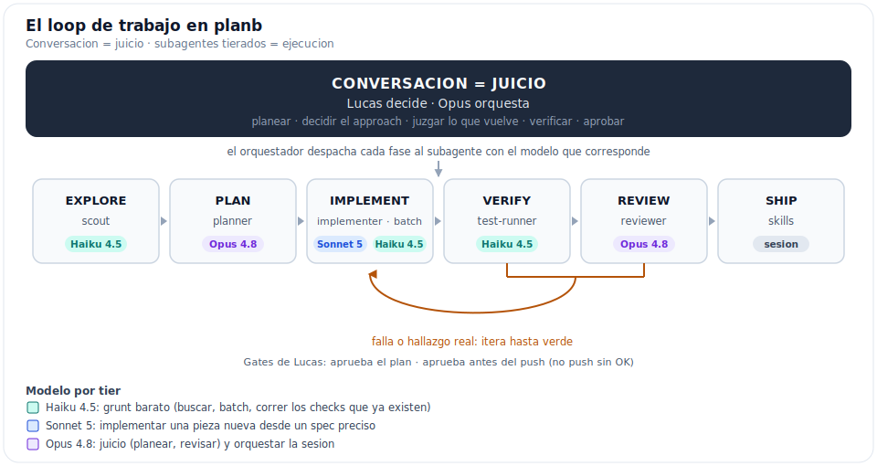

# Workflow con Claude Code (planb)

Cómo trabajamos con Claude Code en este repo: el modelo de orquestación, el loop de trabajo, el
roster de subagentes, los skills, hooks y el cheat sheet de comandos. Está basado en las **best
practices oficiales de Anthropic** (linkeadas al final) y adaptado a planb. Es inhouse: todo vive en
el repo o en la config compartida, sin depender de servicios externos.

Complementa: [`git-workflow.md`](git-workflow.md) (reglas de commit/branch/merge),
[`lessons-learned.md`](lessons-learned.md) (postmortems operativos), [`../../CLAUDE.md`](../../CLAUDE.md)
(cultura + reglas), [`../STATUS.md`](../STATUS.md) (tracker de sprints).

---

## Principio raíz: el contexto es EL recurso

Todas las técnicas de abajo salen de una sola restricción oficial: **el context window se llena
rápido y la performance del modelo se degrada a medida que se llena** (Claude "olvida"
instrucciones y comete más errores). Administrar el contexto es el juego entero. Barato y eficaz
son la misma cosa: menos contexto ruidoso = menos tokens = mejores respuestas.

---

## El modelo: conversación (juicio) + subagentes tierados (ejecución)

Fijo, no negociable. **La conversación (Lucas + orquestador) es la capa de juicio; los subagentes
ejecutan el grunt, en el modelo que el orquestador les asigna.** El orquestador corre en Opus, **es**
el orquestador (no hace falta uno aparte): decide cuándo explorar, planear, ejecutar y revisar, y
despacha cada tarea a un subagente con el tier correcto. **Lucas nunca toca `/model`**: el orquestador
no cambia su propio modelo, pero sí el de cada subagente al despacharlo.



- **En la conversación (Opus):** entender la intención, decidir el approach, **juzgar** lo que
  devuelven los subagentes, decidir qué se shippea, aprobar.
- **En subagentes (tier según la tarea):** búsqueda, inventario, leer muchos archivos, batches,
  correr checks + resumir, implementar desde spec, primer pase de review.

Reglas duras: por default, todo chunk mecánico o voluminoso va a un subagente tierado en vez de
hacerse en la conversación cara. El orquestador **siempre verifica** lo que el subagente devuelve
(puede errar): no se desliga del juicio. Lo determinístico y garantizado va a hooks o skills, no a
"que el agente se acuerde".

---

## El loop de trabajo

El workflow recomendado por Anthropic es **Explore → Plan → Implement → Verify → Review → Ship**
(el diagrama de arriba). Cada fase se despacha al subagente de su tier; Explore y Plan se saltean si
el diff se describe en una frase.

| Fase | Qué | Cómo en planb |
|---|---|---|
| **Explore** | Entender antes de tocar. Sin editar. | Subagente `scout` (Haiku 4.5) para research ruidoso: lee 100 archivos y devuelve `file:line`, tu contexto no se ensucia. Plan mode (`Shift+Tab`) para explorar en la conversación. |
| **Plan** | Diseño antes de código. | Para algo grande: `planner` (Opus 4.8) entrevista (`AskUserQuestion`) y escribe un `SPEC.md`, después sesión fresca para ejecutar. Trazar a una US ([`../STATUS.md`](../STATUS.md)). |
| **Implement** | Código con verificación incorporada. | `implementer` (Sonnet 5) una pieza nueva desde el spec, o `batch` (Haiku 4.5) el mismo cambio sobre N archivos. Diseño primero (mockup del canvas para UI), server actions puras (ADR-0046). |
| **Verify** | Evidencia, no aserción. | `test-runner` (Haiku 4.5) corre los checks que YA existen (unit/integration/E2E) y devuelve pass/fail. Regla nuestra: si toca rutas reales, correr el spec E2E visible antes de pedir OK (skill `e2e-zone`). |
| **Review** | Revisor adversarial en contexto fresco. | `reviewer` (Opus 4.8) razona sobre la correctness que los tests NO cubren. Un modelo fresco que no vio el razonamiento juzga mejor. |
| **Ship** | Commit + PR + merge + tracker. | Skills `ship` (verify + commit conventional, frena antes del push) y `sync-notion` (US a `Done` en todas las vistas). PR-only, merge **Rebase** por default. |

> Ojo con el reviewer: si le pedís que busque gaps, siempre encuentra algo. Está prompteado para
> marcar solo lo que afecta correctness o los requisitos, no preferencias de estilo. Perseguir cada
> hallazgo lleva a over-engineering.

---

## El roster de subagentes

Los subagentes corren en su **propio context window** con tools y permisos propios, y devuelven solo
un resumen. Los custom se definen en `.claude/agents/<nombre>.md` (frontmatter `name`, `description`,
`tools`, `model`) y se **cargan al arrancar la sesión** (no en caliente). Los "nativos" se despachan
con override de modelo, sin archivo.

| Subagente | Modelo | Effort | Definición | Cuándo lo despacha el orquestador |
|---|---|---|---|---|
| **scout** | Haiku 4.5 | low | `.claude/agents/scout.md` | Buscar e inventariar. Devuelve `file:line`, no opina ni propone cambios. |
| **test-runner** | Haiku 4.5 | low | `.claude/agents/test-runner.md` | Correr tests / build / lint y devolver pass/fail + las fallas, sin el output verboso. |
| **batch** | Haiku 4.5 | low | nativo (override al despachar) | El MISMO cambio mecánico sobre N archivos, sin criterio por unidad. |
| **implementer** | Sonnet 5 | medium | `.claude/agents/implementer.md` | UNA pieza nueva coherente desde un spec preciso. |
| **reviewer** | Opus 4.8 | high | `.claude/agents/reviewer.md` | Review adversarial de correctness en contexto fresco, antes del commit. |
| **planner** | Opus 4.8 | high | nativo (override al despachar) | Diseñar el approach, entrevistar, escribir el spec. |

El **effort** (esfuerzo de razonamiento) se setea al despachar y sigue al tier: Haiku/low,
Sonnet/medium, Opus/high. Menos esfuerzo = menos tokens de thinking; se sube solo donde el juicio lo
pide. El orquestador siempre verifica lo que el subagente devuelve.

### verify (Haiku) vs review (Opus)

No son lo mismo y por eso tienen tiers opuestos:

- **verify** (`test-runner`, Haiku 4.5): corre los checks que **ya existen** (tests, build, lint, E2E).
  Es pass/fail objetivo; la inteligencia está en los tests, no en el que los corre. Por eso es barato.
- **review** (`reviewer`, Opus 4.8): razona sobre la correctness que los tests **NO** cubren (edge cases,
  race conditions, invariantes de dominio, gating flojo). Tests verdes ≠ correcto. Por eso es caro y
  de bajo volumen.

### implementer (Sonnet) vs batch (Haiku)

Discriminador: **¿cada unidad necesita su propio razonamiento?**

- **implementer** (Sonnet 5): UNA cosa nueva coherente que necesita matiz (un feature, un endpoint, una
  vista). Sí necesita criterio, por eso Sonnet.
- **batch** (Haiku 4.5): el MISMO transform mecánico sobre muchos archivos (renombrar, mover un import,
  aplicar un fix repetido). No hay criterio por unidad, es paralelizable, por eso Haiku.

---

## Model tiering (el lever barato): "Advisor Strategy"

Separar el juicio (caro) de la ejecución (barata): Opus como adviser (planear, decidir, revisar),
Sonnet para implementar, Haiku para el grunt. En planb **no cambiamos el modelo de la sesión a mano**:
el orquestador se queda en Opus y baja de tier despachando subagentes. El `/model` manual y el
`--model` de headless existen como features de Claude Code, pero nuestro default es el dispatch tierado.

Anthropic recomienda: Sonnet para la mayoría del coding, Opus reservado para decisiones arquitectónicas
o razonamiento multi-paso, Haiku para tareas simples de subagente. La familia actual es Opus 4.8, Sonnet 5 y Haiku 4.5;
el `model: sonnet` que despacha el orquestador resuelve a Sonnet 5. Haiku es el tier más barato por
token y Opus el más caro (los números exactos viven en la pricing page de Anthropic y driftean, no los
hardcodeo acá). El grueso de nuestros tokens es mecánico (búsqueda, batch, correr checks), baja de tier.
---

## Los dos modos de loop

"Loopear" no es una cosa sola. Hay dos modos, y usamos casi siempre el primero:

**1. Loop interactivo (el default, día a día).** Es el diagrama de arriba: nosotros (Lucas +
orquestador) en el asiento de las decisiones, el orquestador rutea cada fase a su subagente y
verifica. El **verification loop** vive acá: implementá → corré el check (tests/build/E2E) → iterá
hasta verde. El loop se cierra cuando el check pasa **y** Lucas aprueba. Barato porque el grueso corre
en subagentes de tier bajo y la conversación cara solo juzga.

**2. Loop desatendido (Ralph / `/loop`).** Modelo fijo, te vas, con una condición de "done" medible
y un check automático. Para tareas mecánicas con "done" inequívoco (refactor grande, batch, cobertura
de tests, greenfield). `/goal` define el "done", `/loop` mantiene a Claude hasta cumplirlo; Ralph
Wiggum (plugin oficial) es el loop overnight con `--max-iterations`.

**Cuándo NO** el desatendido: juicio, diseño subjetivo, debugging puntual. **Costo/riesgo**: siempre
`--max-iterations` (un loop de 50 en un codebase grande cuesta `$50-100+`). El loop es tan bueno como
su check: sin verificación real, itera sobre basura.

---

## Guardrails: hooks (inhouse, cero tokens de modelo)

Los hooks son shell scripts determinísticos: **lo que debe pasar siempre, sin excepción** (a
diferencia de las reglas del CLAUDE.md, que son advisory). No consumen tokens de modelo.

Ya tenemos [`lefthook.yml`](../../lefthook.yml) (git hooks: format, conventional-commits, em-dash,
pre-push tests). Los **hooks de Claude Code** viven en `.claude/settings.json`, que **está commiteado**
(el `.gitignore` ignora `.claude/*` pero des-ignora `settings.json`, `agents/` y `skills/`), así que
son compartibles inhouse sin tocar nada más.

Eventos útiles: `PreToolUse` (bloquear/filtrar antes), `PostToolUse` (formatear/loggear después),
`Stop` (forzar a seguir hasta que un check pase), `Notification`.

Candidatos concretos para planb:
- **Filtrar output verboso** (PreToolUse sobre Bash): grepear solo `FAIL`/`ERROR` de los tests antes
  de que entren al contexto (la doc oficial: baja de decenas de miles de tokens a cientos).
- **Recordatorio de Notion-sync** (Stop): si un merge acaba de pasar, recordar actualizar `Status`.
- **Bloquear escrituras peligrosas** (PreToolUse): ej. a `migrations/` sin confirmación.

Claude los escribe: "escribí un hook que corra `just lint-fix` tras cada edit".

---

## Skills (workflows repetibles inhouse)

Un `SKILL.md` en `.claude/skills/<nombre>/` empaqueta un procedimiento del repo. Se **cargan al
arrancar la sesión**. Un skill se gana su lugar solo si es un procedimiento multi-paso con conocimiento
que NO es ya un recipe de `just` ni un hook. Cada uno es **lean y apunta a código/docs reales** (el
ejemplo canónico a copiar), no re-describe el patrón.

Dos modos de trigger:

- **Auto** (el modelo lo agarra solo, description "pushy"): conocimiento que se aplica cuando la tarea
  matchea.
- **Explícito** (`disable-model-invocation`, tipeás `/skill`): tienen side-effect real (git, Notion,
  regenerar archivos); no querés que se auto-disparen.

| Skill | Trigger | Qué encoda |
|---|---|---|
| `slice-backend` | auto | Vertical slice backend de 6 archivos (ej. `RegisterEnrollment`). |
| `slice-frontend` | auto | Feature flat, server actions puras ADR-0046 (ej. `sign-in`, `write-review`). |
| `integration-event` | auto | Evento cross-módulo owned-by-receiver, ADR-0045 (ej. `ReviewRemovalRequested`). |
| `dapper-read` | auto | Read con Dapper cross-schema (ej. `ListUniversitiesAsync`). |
| `e2e-zone` | auto | Regla cultural: tocás rutas reales → E2E visible antes de pedir OK. |
| `new-adr` | explícito | ADR MADR: las 3 preguntas de "amerita" + el formato. |
| `new-us` | explícito | Doc de US desde la plantilla + page en Notion, cross-linkeados. |
| `ship` | explícito | Verify → chequeo em-dash → commit conventional → frena antes del push. |
| `sync-notion` | explícito | Gate post-merge: US a `Done` en todas las vistas, sin romper options. |
| `regen-screenshots` | explícito | Pipeline canvas HTML → PNG de referencia del design system. |

---

## Disciplina de CLAUDE.md

CLAUDE.md se carga en **cada** sesión, así que solo va lo que aplica **siempre**. La doc oficial es
tajante: **"los CLAUDE.md inflados hacen que Claude ignore tus instrucciones reales"**. Por cada línea:
*"¿sacarla causaría un error?"* Si no, se borra o se convierte en hook. Lo que aplica *a veces* va a
un **skill** (on-demand), no al CLAUDE.md. Tratar el CLAUDE.md como código: podarlo cuando algo sale mal.

---

## Cheat sheet de comandos

**Manejo de contexto / sesión**
```
Shift+Tab       Entrar/salir de plan mode (explorar sin editar)
/clear          Reset de contexto entre tareas no relacionadas
/compact <foco> Comprimir historia preservando lo indicado
Esc             Frenar a Claude mid-acción (contexto preservado)
Esc Esc / /rewind  Menú de rewind (restaurar código/conversación a un checkpoint)
/context        Ver qué está ocupando el context window
/usage          Ver tokens/costo de la sesión
/btw            Pregunta lateral que NO entra al contexto
```

**Loops / verificación / review**
```
/goal           Definir la condición de "done" de un loop
/loop           Loopear hasta cumplir el /goal
/code-review    Review del diff por bugs en subagente fresco
/ralph-loop "..." --completion-promise "X" --max-iterations N   (plugin ralph-wiggum)
/cancel-ralph   Cortar un loop de Ralph
```

**Config / extensión**
```
/init           Generar un CLAUDE.md base desde el codebase
/hooks          Ver/administrar hooks
/plugin         Marketplace de plugins (skills/hooks/subagentes/MCP)
/permissions    Allowlist de comandos/dominios
/mcp            Ver/administrar MCP servers
```

**CLI (headless / batch / paralelo)**
```
claude -p "prompt"                        Modo no-interactivo (CI, scripts)
claude -p "..." --output-format json      Salida parseable
claude -p "..." --model haiku             Forzar modelo (executor barato)
claude -p "..." --allowedTools "Edit,..." Acotar permisos en batch
claude --permission-mode plan             Arrancar en plan mode
claude --continue / --resume              Retomar sesión
git worktrees                             Sesiones paralelas aisladas
```

**planb (`just`)**
```
just dev / dev-backend / dev-frontend     Levantar el stack
just test / lint / lint-fix               Tests + Biome/dotnet format
just ci                                   Las mismas gates que GHA
just migrate / infra-up / infra-reset     DB + infra
```

---

## Costo / eficiencia: los levers reales (en orden de impacto)

1. **Contexto chico**: `/clear` entre tareas, subagentes que aíslan el research, hooks que filtran
   output, skills on-demand en vez de CLAUDE.md gordo, prompts específicos (menos file reads).
2. **Dispatch tierado**: el orquestador en Opus solo juzga; el grunt baja a Haiku/Sonnet en subagentes.
3. **Plan mode** en lo no-trivial: evita el rework caro de ir por el camino equivocado.
4. **Effort bajo** en subagentes mecánicos (el thinking se cobra como output).
5. **Verification loops**: que el check cierre el loop en vez de vos, pero siempre con `--max-iterations`.
6. No usar Opus 1M por default: tras ~400k tokens la relevancia cae, el contexto extra solo suma costo.

---

## Referencias (oficiales de Anthropic)

- [Best practices for Claude Code](https://code.claude.com/docs/en/best-practices)
- [Manage costs effectively](https://code.claude.com/docs/en/costs)
- [Automate actions with hooks](https://code.claude.com/docs/en/hooks-guide)
- [Create custom subagents](https://code.claude.com/docs/en/sub-agents)
- [ralph-wiggum plugin (autonomous loops)](https://github.com/anthropics/claude-code/blob/main/plugins/ralph-wiggum/README.md)
- [Building Effective AI Agents](https://www.anthropic.com/research/building-effective-agents)
