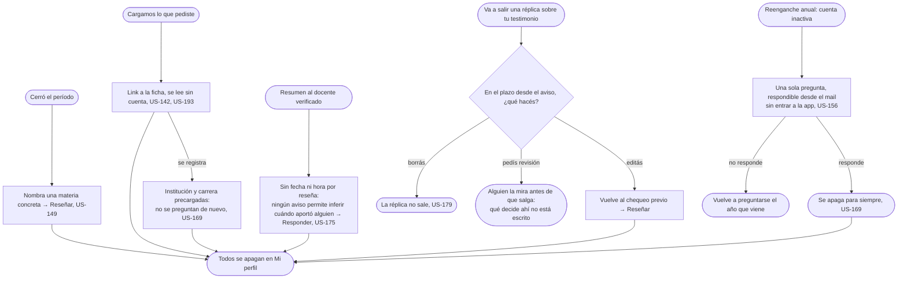

# Avisos: el flujo

> Reemplaza a la fila 08 (Los avisos, lo que cierra el circuito) de la tabla de flujos del [mapa](../map.md). Personas: todos los que reciben un mail. Disparador: cerró el período, se cargó lo que alguien pidió, hay un resumen para el docente, va a salir una réplica sobre un testimonio propio, o una cuenta inactiva nunca dijo si se recibió. Stories que cubre: US-142, US-149, US-156, US-175, US-193, US-179, US-169.

## Salidas y errores

- **No responder el reenganche anual no cierra nada**: la pregunta vuelve a mandarse el año que viene (US-156); solo responderla la apaga para siempre (US-169).
- **El resumen al docente nunca dice cuándo se publicó cada reseña**: es periódico, sin fecha ni hora por reseña (US-175); ningún aviso permite reconstruir el momento de un aporte.
- **Registrarse desde el link de "cargamos lo que pediste" precarga institución y carrera**: no se vuelven a preguntar (US-142, US-169).
- **Ningún hecho ya declarado se vuelve a preguntar** por otro camino de aviso (US-169).

## Pantallas

Este flujo no dibuja pantallas del sitio: los cinco caminos son el contenido de cinco mails distintos, y todos viven en [Avisos](screens/SC-034-mail/README.md). Dónde se apaga cada uno es [Mi perfil](../student/undo/screens/SC-019-my-profile/README.md), de la épica Deshacer.

## Lo que el flujo no dibuja y la ficha de la pantalla decide

El copy exacto de cada mail; qué pasa si el plazo de US-179 vence sin que el autor edite, borre o pida revisión, y qué resuelve la revisión pedida; la cadencia del resumen al docente; cómo se ve en Mi perfil el lugar donde se apaga cada aviso.
