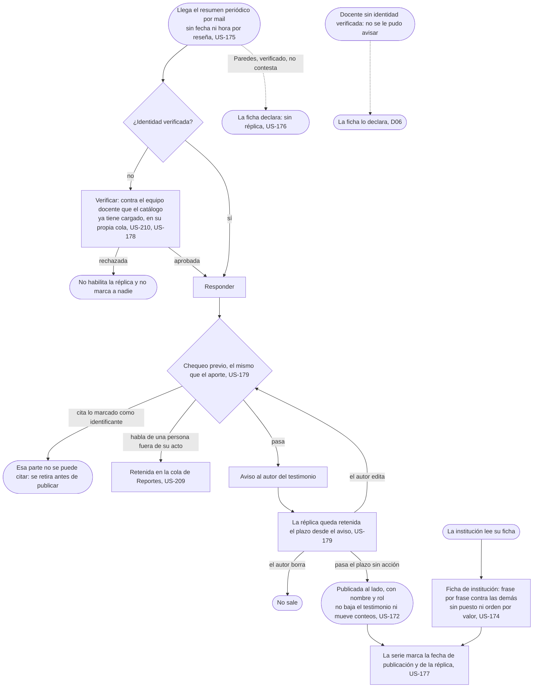

# Replicar: el flujo

> Reemplaza a las filas 06 (Claudia contesta, con nombre porque es público) y 10 (Los evaluados, responder y abandonar) de la tabla de flujos del [mapa](../../map.md); la mitad de "Mi situación" de la fila 10 vive en Reseñar, sigue en [Reseñar](../../student/write-a-review/flow.md). Personas: Claudia, Prof. Paredes, la institución. Disparador: llega el resumen periódico por mail. Stories que cubre: US-172, US-173, US-174, US-175, US-176, US-177, US-178, US-179, US-210, US-209.

## Salidas y errores

- **Identidad rechazada**: no habilita la réplica y no marca a nadie (US-178, US-210).
- **La réplica cita la parte marcada como identificante**: se retira antes de publicarse (US-179).
- **La réplica habla de una persona fuera de su acto**: queda retenida en la cola de Reportes hasta que alguien la mire (US-209).
- **El autor borra el testimonio en el plazo**: la réplica no sale (US-179).
- **Paredes no contesta**: la ficha declara "sin réplica", nunca "no quiso responder" (US-176, D06).
- **Publicada**: no baja el testimonio ni mueve ningún conteo (US-172).

## Pantallas

Todo el recorrido de la réplica pasa por una sola: [Responder](screens/SC-020-respond/README.md), a la que se llega desde el link del resumen por mail (nodo A) y que solo abre el campo de respuesta con identidad verificada (nodo B). Lo que la réplica publica se lee en las fichas de [cátedra](../../student/choose-where-to-study/screens/SC-002-chair/README.md) y de [institución](screens/SC-005-institution/README.md), que son de otra épica.

## Lo que el flujo no dibuja y la ficha de la pantalla decide

El copy exacto del estado del canal; cuánto dura el plazo de retención antes de publicar (US-179, el número que falta); el layout de la comparación frase por frase en la Ficha de institución.
