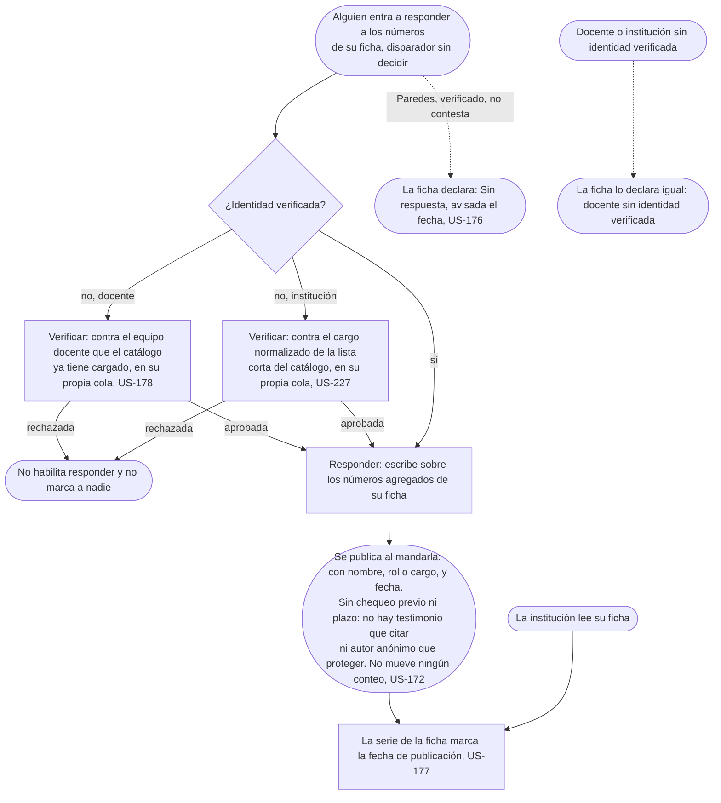

# Responder: el flujo

> Reemplaza a las filas 06 (Claudia contesta, con nombre porque es público) y 10 (Los evaluados, responder y abandonar) de la tabla de flujos del [mapa](../../map.md); la mitad de "Mi situación" de la fila 10 vive en Reseñar, sigue en [Reseñar](../../student/write-a-review/flow.md). Personas: Claudia, Prof. Paredes, la institución. Disparador: alguien con identidad verificada entra a responder a los números de su ficha (qué mail o evento se lo avisa es un hueco declarado en el README de la épica). Stories que cubre: US-172, US-174 (retirada), US-176, US-177, US-178, US-227.

## Salidas y errores

- **Identidad rechazada**: no habilita responder y no marca a nadie (US-178 para el docente, US-227 para la institución).
- **Nadie respondió todavía**: la ficha declara "Sin respuesta · avisada el [fecha]", nunca "no quiso responder" (US-176).
- **Publicada**: no mueve ningún conteo (US-172).

## Pantallas

Todo el recorrido pasa por una sola: [Responder](screens/SC-020-respond/README.md), a la que se llega con identidad ya verificada (nodo B) o derivando primero a Verificar. Lo que la respuesta publica se lee en las fichas de [cátedra](../../student/choose-where-to-study/screens/SC-002-chair/README.md) y de [institución](screens/SC-005-institution/README.md), que son de otra épica.

## Lo que el flujo no dibuja y la ficha de la pantalla decide

El copy exacto del estado del canal; qué evento dispara el aviso que deja la fecha en "avisada el [fecha]" (hueco declarado en el README de la épica); si hay un tope de longitud para la respuesta.
