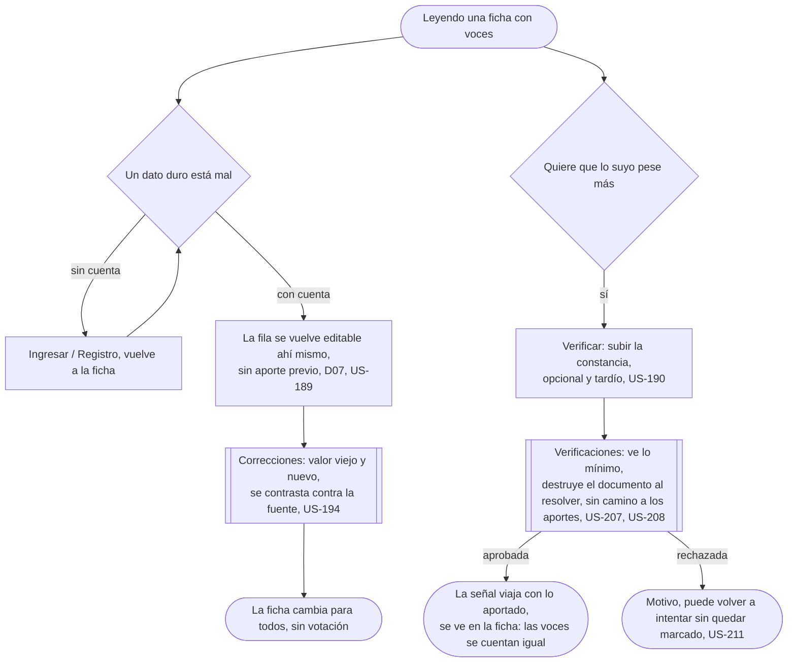

# Cuidar lo publicado: el flujo

> No reemplaza ninguna fila del mapa: el mapa dibuja Corregir como "acción inline", sin fila de flujo propia. Personas: quien vuelve (corrige), quien ya aportó (se verifica). Disparador: leer una ficha con conteos o con un dato duro mal cargado. Stories que cubre: US-189, US-190 (y lo que tocan del otro lado: US-194, US-207, US-208, US-211).

Pantalla de esta épica: [Verificar](screens/SC-022-verify/README.md) (E1).

## Salidas y errores

- **Sin cuenta**: corregir y verificarse la piden; leer la ficha y reportarla no.
- **La corrección no cambia nada hasta contrastarse contra la fuente** (US-194): después cambia para todos, sin votación.
- **La constancia se destruye al resolver** (US-207) y esa cola no tiene camino a los aportes de la misma cuenta (US-208).
- **Verificarse no mueve ninguna proporción**: las voces se cuentan igual, verificadas o no (US-190).
- **Una constancia adulterada se rechaza con motivo**, y quien la subió puede volver a intentarlo sin quedar marcado (US-211).

## Lo que el flujo no dibuja y la ficha de la pantalla decide

Cómo se ve la señal de verificado sin identificar a nadie; qué datos duros son editables inline y cuáles quedan reservados al catálogo.
