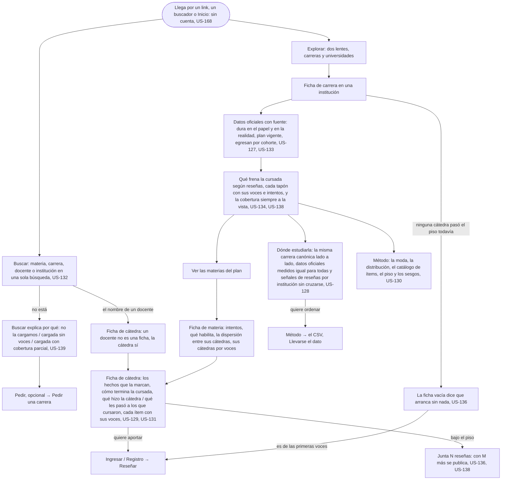

# Elegir dónde estudiar: el flujo

> Reemplaza a las filas 01 (Valentina tiene que elegir en dos meses) y 11 (Buscar, cuando te recomiendan una persona) de la tabla de flujos del [mapa](../../map.md). Personas: Valentina, Silvia, quien lee. Disparador: un link, un buscador, una recomendación, o Inicio. Stories que cubre: US-127 a US-134, US-136, US-138, US-139, US-168, US-171.

## Pantallas

- [La entrada](screens/SC-004-entrance/README.md): el punto de entrada cuando no llega por un link, un buscador o una recomendación directa (nodo A).
- [Explorar](screens/SC-003-explore/README.md): las dos lentes, carreras y universidades (nodo B).
- [Buscar](screens/SC-006-search/README.md): la única búsqueda que devuelve los cuatro sujetos con ficha (nodo S).
- [Ficha de cátedra](screens/SC-002-chair/README.md): destino de buscar un docente (nodo S1), y la ficha a la que se llega a leer cátedra por cátedra (nodo E2).
- [Ficha de carrera](screens/SC-001-career/README.md): la identidad, los datos oficiales con fuente, qué frena la cursada según reseñas y la cobertura siempre a la vista (nodo C).
- [Ficha de materia](screens/SC-007-subject/README.md): intentos, qué habilita, la dispersión entre sus cátedras y sus cátedras ordenadas por voces (nodo E).
- [Dónde estudiarla](screens/SC-008-where-to-study/README.md): la comparación lado a lado, sin ganador (nodo F).
- [Método](../take-the-data/screens/SC-021-method/README.md): la moda, la distribución, el catálogo de ítems y los sesgos, dueña de [Llevarse el dato](../take-the-data/README.md) (nodos F2, G).

## Salidas y errores

- **Lo que busca no está cargado** (US-139): la ficha no existe y no se inventa; Buscar y Explorar explican el vacío y ofrecen Pedir. Sigue en [Pedir una carrera](../request-a-career/flow.md).
- **Cargada y sin voces** (US-136): la ficha existe vacía, dice que arranca sin nada y que se puede ser de las primeras voces.
- **Cargada, bajo el piso** (US-136, US-138): tiene reseñas pero ninguna cátedra llegó todavía a las 10; se muestra el conteo real hacia el piso, nunca un adelanto de conteos.
- **Cobertura parcial** (US-134): la carrera se lee con lo que ya pasó el piso, con su cobertura real a la vista; nunca se inventa un cero ni se completa con lo que falta.
- **Quiere ordenar la comparación**: no se ordena por valor en pantalla; baja el CSV (US-128, US-180).
- **Nada de esto pide cuenta** (US-168); nada está destacado ni patrocinado (US-171); ninguna ficha afirma una causa (US-184).

## Lo que el flujo no dibuja y la ficha de la pantalla decide

Qué lentes y qué orden ofrece Explorar; cómo se ven las materias del plan detrás de "Ver las materias"; el layout de Dónde estudiarla en celular con muchas ofertas; qué muestra la Ficha de institución además de sus carreras y su transparencia relevada (US-174, US-177, en [Responder](../../reviewed/reply/README.md)).
