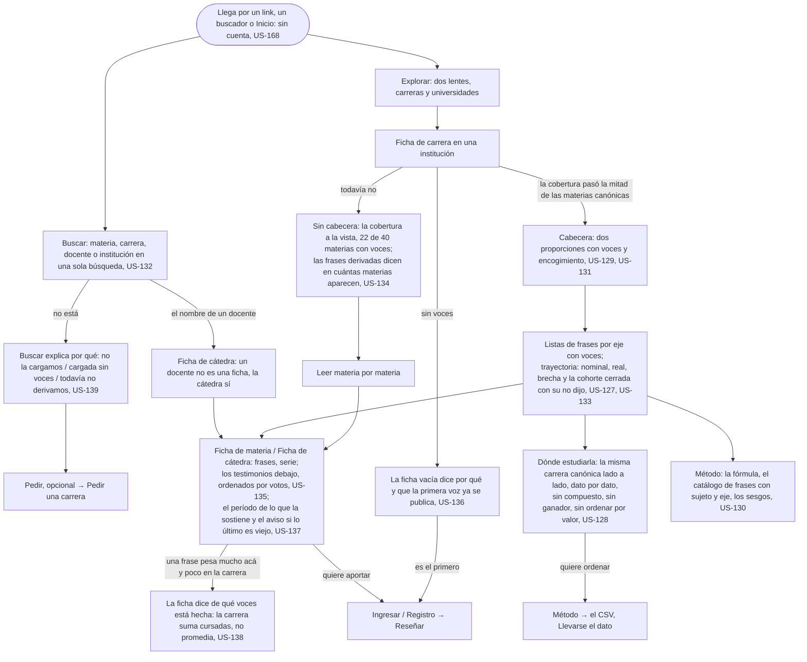

# Elegir dónde estudiar: el flujo

> Reemplaza a las filas 01 (Valentina tiene que elegir en dos meses) y 11 (Buscar, cuando te recomiendan una persona) de la tabla de flujos del [mapa](../../map.md). Personas: Valentina, Silvia, quien lee. Disparador: un link, un buscador, una recomendación, o Inicio. Stories que cubre: US-127 a US-134, US-135, US-136, US-137, US-138, US-139, US-168, US-171.

## Pantallas

- [Inicio](screens/SC-004-home/README.md): el punto de entrada cuando no llega por un link, un buscador o una recomendación directa (nodo A).
- [Explorar](screens/SC-003-explore/README.md): las dos lentes, carreras y universidades (nodo B).
- [Buscar](screens/SC-006-search/README.md): la única búsqueda que devuelve los cuatro sujetos con ficha (nodo S).
- [Ficha de cátedra](screens/SC-002-chair/README.md): destino de buscar un docente (nodo S1), y una de las dos fichas a las que se llega a leer materia por materia (nodo E).
- [Ficha de carrera](screens/SC-001-career/README.md): la cabecera con gate, las listas por eje y la trayectoria (nodo C).
- [Ficha de materia](screens/SC-007-subject/README.md): la otra ficha del nodo E, cuando la cabecera de carrera todavía no derivó y se lee materia por materia (nodo D2).
- [Dónde estudiarla](screens/SC-008-where-to-study/README.md): la comparación lado a lado, sin ganador (nodo F).
- [Método](../take-the-data/screens/SC-021-method/README.md): la fórmula, el catálogo de frases y los sesgos, dueña de [Llevarse el dato](../take-the-data/README.md) (nodos F2, G).

## Salidas y errores

- **Lo que busca no está cargado** (US-139): la ficha no existe y no se inventa; Buscar y Explorar explican el vacío y ofrecen Pedir. Sigue en [Pedir una carrera](../request-a-career/flow.md).
- **Cargada y sin voces** (US-136): la ficha existe vacía, dice que la primera voz ya se publica con sus voces y su encogimiento, sin escalones.
- **Cargada con voces y sin cabecera** (US-134): se lee materia por materia; nunca un cero ni una cabecera armada con tres materias.
- **Lo último es viejo** (US-137): la ficha lo avisa; los testimonios muestran su período.
- **Quiere ordenar la comparación**: no se ordena por valor en pantalla; baja el CSV (US-128, US-180).
- **Nada de esto pide cuenta** (US-168); nada está destacado ni patrocinado (US-171); ninguna ficha afirma una causa (US-184).

## Lo que el flujo no dibuja y la ficha de la pantalla decide

Qué lentes y qué orden ofrece Explorar; cómo se lee la trayectoria sin vocabulario (US-133); el layout de Dónde estudiarla en celular con muchas ofertas; qué muestra la Ficha de institución además de la serie y la comparación frase por frase (US-174, US-177, en [Replicar](../../reviewed/reply/README.md)).
