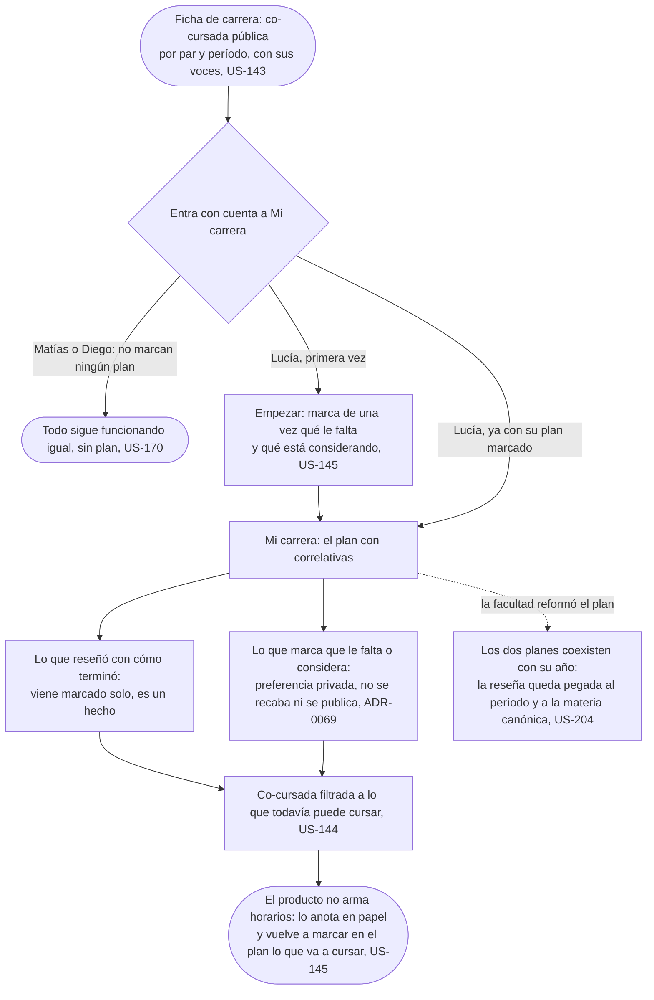

# Mi carrera: el flujo

> Reemplaza a la fila 04 de la tabla de flujos del [mapa](../../map.md) (Lucía no quiere repetir el error). Persona: Lucía; también Matías y Diego, que no marcan ningún plan (US-170). Disparador: viene de la Ficha de carrera con la co-cursada pública a la vista, o abre Mi carrera para decidir el próximo cuatrimestre. Stories que cubre: US-143, US-144, US-145, US-170, US-204.

## Pantallas

- [Ficha de carrera](../choose-where-to-study/screens/SC-001-career/README.md): la co-cursada pública, por par y período, antes de entrar con cuenta (nodo A).
- [Mi carrera](screens/SC-011-my-career/README.md): el plan con correlativas, lo reseñado como hecho, lo marcado como preferencia y la co-cursada filtrada (nodos C, D, E, F, G, I).
- [Empezar](screens/SC-012-onboarding/README.md): la primera vez, donde se marca de una vez qué falta y qué se considera antes de ver el plan (nodo O). Quien ya lo marcó entra directo a Mi carrera, y quien no quiere marcar nada tampoco pasa por acá (US-170).

## Salidas y errores

- **Sin plan marcado, todo sigue igual** (US-170): reseñar, leer y votar no dependen de haber marcado nada en Mi carrera.
- **Sin cuenta no se llega a Mi carrera**; la co-cursada pública de la Ficha de carrera sí se lee sin cuenta (el gate está en la acción, no en la lectura).
- **La facultad reformó el plan**: los dos planes coexisten con su año, y la reseña sigue pegada al período y a la materia canónica, no a la fila de un plan en particular (US-204).
- **Lo marcado no es un hecho**: se puede cambiar en cualquier momento sin que quede rastro público ni entre a ningún agregado.
- **Una oferta que ya tenés marcada cambia** (una correlativa que se corrige, por ejemplo): te enterás de qué cambió (US-201), aunque este flujo no dibuja ese aviso.

## Lo que el flujo no dibuja y la ficha de la pantalla decide

- Cuántos pares de co-cursada entran en pantalla y cómo se ordenan cuando son muchos.
- Qué pregunta Empezar la primera vez, además de por dónde vas.
- Qué pasa en pantalla con la preferencia marcada cuando el plan se reforma.
- Cómo se distingue visualmente lo reseñado (hecho) de lo marcado (preferencia) dentro del mismo plan.
