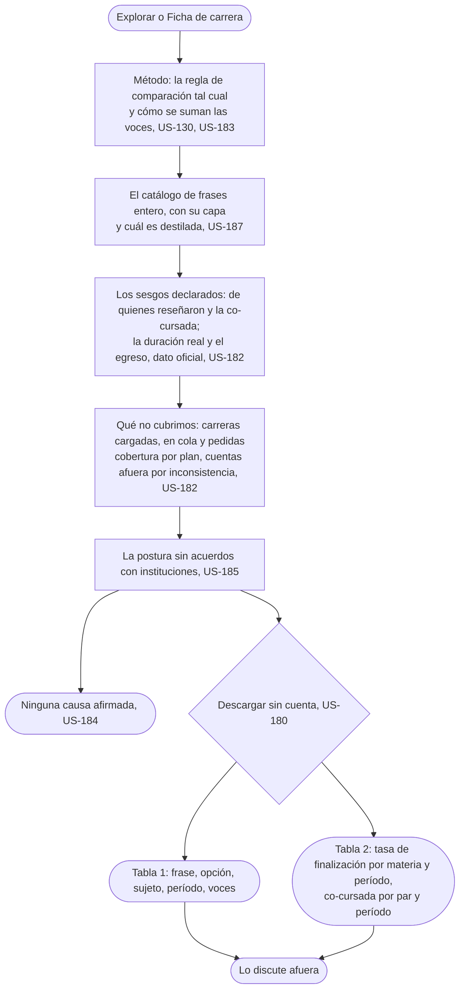

# Llevarse el dato: el flujo

> Reemplaza a la fila 07 de la tabla de flujos del [mapa](../../map.md) (Rocío se lleva el dato). Persona: Rocío. Disparador: entra a Explorar o a una Ficha de carrera y sigue el link a Método. Stories que cubre: US-180, US-182, US-183, US-184, US-185, US-181, US-186, US-187, US-130.

De B a G es una sola pantalla hoy: [Método](screens/SC-021-method/README.md) (si se parte en varias todavía está abierto, ver su ficha).

## Salidas y errores

- **Lo que se descarga es lo que se publica**, ni más fino ni más grueso: nunca nombre, cuenta ni perfil, y el campo libre no se exporta en bloque, porque nunca se publica.
- **Cuentas afuera por inconsistencia**: se publica cuántas, y no entran a ningún agregado.
- **US-181 y US-186 (concepto rebasado el 2026-08-25)**: dependían de testimonios publicados que después se retiraban; [ADR-0084](../../../decisions/0084-free-text-feeds-curation-and-is-never-published.md) retira la publicación del campo libre, así que no hay nada que "retirar" después de publicado. Falta decidir el reemplazo.
- **Ninguna ficha afirma una causa** (US-184); la descarga es sin cuenta y sin registro (THESIS, "Posición").

## Lo que el flujo no dibuja y la ficha de la pantalla decide

Cómo se organiza Método en una pantalla o varias; el formato exacto de las columnas del CSV; con qué periodicidad se regenera el crudo.
