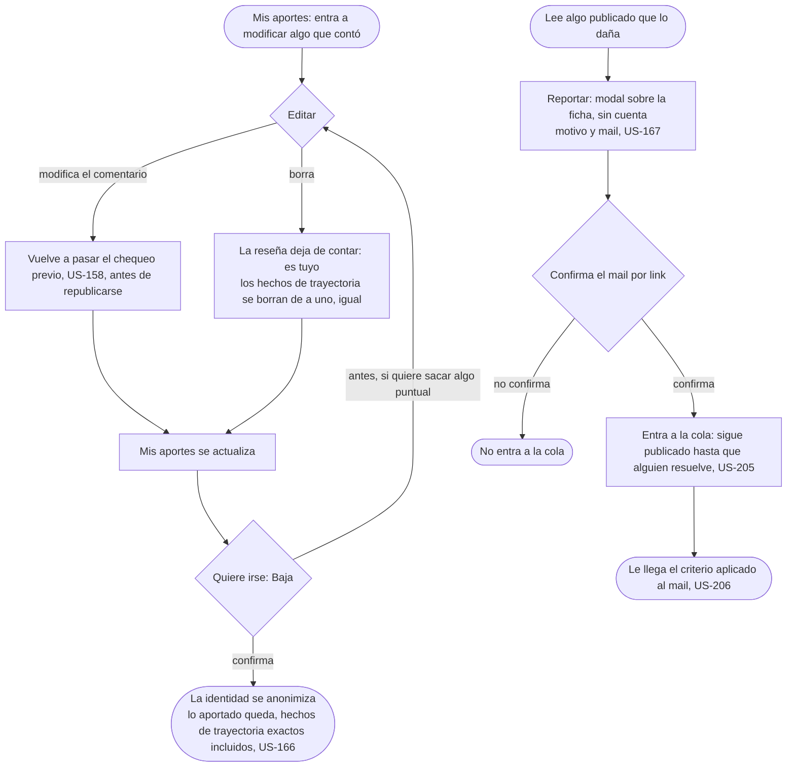

# Deshacer: el flujo

> Reemplaza a la fila 09 de la tabla de flujos del [mapa](../../map.md) (Deshacer, lo que hace que se animen), y dibuja también el reporte sin cuenta, que el mapa tiene como acción inline sobre la ficha. Personas: quien ya aportó (Matías, Lucía, Diego); quien lee, incluido el que una reseña difama, para reportar sin cuenta (US-167). Disparador: entra a Mis aportes para modificar algo que contó, o lee algo publicado que lo daña. Stories que cubre: US-165, US-166, US-167, US-158, US-205, US-206.

## Pantallas

- [Mis aportes](screens/SC-018-my-contributions/README.md): la entrada a modificar algo publicado, y donde se actualiza después de editar o borrar (nodos A, C).
- [Editar](screens/SC-017-edit/README.md): modificar el comentario (que vuelve al chequeo previo) o borrar el aporte, de a uno (nodos B, B1, B2).
- [Mi perfil](screens/SC-019-my-profile/README.md): de donde se abre la puerta a Baja; el diagrama no la dibuja como paso propio, "Quiere irse" (nodo D) pasa por ahí.
- [Baja](screens/SC-016-delete-account/README.md): confirmar la baja, que anonimiza la identidad y preserva lo aportado (nodos D, E).
- [Ficha de cátedra](../choose-where-to-study/screens/SC-002-chair/README.md) y [Ficha de materia](../choose-where-to-study/screens/SC-007-subject/README.md): donde vive la acción "Reportar", inline y sin cuenta (nodos F, G).
- [Reportes](../../team/moderate-without-breaking-the-product/screens/SC-031-reports/README.md): la cola donde una persona resuelve el reporte ya confirmado (nodos I, J).

## Salidas y errores

- **Comentario editado**: vuelve al chequeo previo antes de republicarse, el mismo que corre al reseñar (US-158).
- **Reseña borrada**: deja de contar en cualquier agregado; los hechos de trayectoria declarados se borran de a uno si el autor lo pide, no hay borrado en bloque.
- **Baja de cuenta**: irreversible en la identidad (se anonimiza) y preserva lo aportado exacto (US-166, D10); lo que se quiera sacar puntual, antes por Editar.
- **Reporte sin mail confirmado**: no entra a la cola.
- **Mientras el reporte espera**: sigue publicado (US-205); nada baja solo por cantidad de reportes.

## Lo que el flujo no dibuja y la ficha de la pantalla decide

Qué campos de una reseña publicada admite Editar (período, materia, o solo frases y comentario); el copy exacto de Baja; el motivo desplegable de Reportar y cuánto tiempo se guarda un aporte a medias antes de retomarlo o perderlo.
