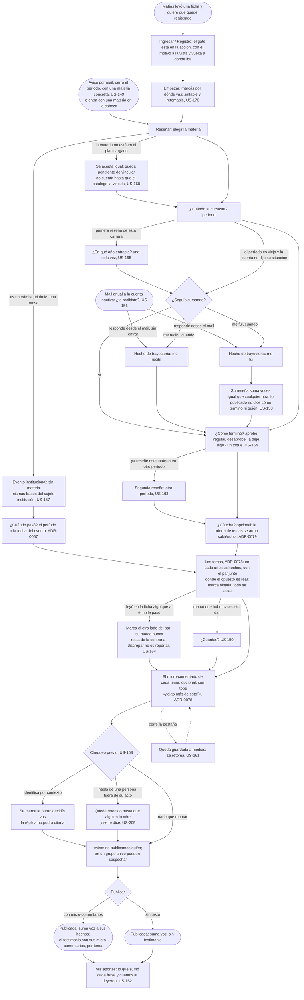

# Reseñar: el flujo

> Reemplaza a las filas 03, 05, 12 y 14 de la tabla de flujos del [mapa](../../map.md) (Matías vuelve y esta vez completa; Lucía reseña; el texto que te delata; cuando el dato no me alcanza), que ahora son un solo recorrido con sus ramas. Personas: Lucía, Matías (llega desde una ficha y recién ahí pasa el umbral) y Diego (llega sin cursar). Disparador: el aviso al cerrar el período, una ficha que se acaba de leer, o entrar con una materia en la cabeza. Stories que cubre: los 19 de la épica (US-146, US-147, US-148, US-149, US-150, US-151, US-152, US-153, US-154, US-155, US-156, US-157, US-158, US-159, US-160, US-161, US-162, US-163, US-164), más las garantías US-169 y US-170 que se verifican acá.

## Pantallas

- [Reseñar](screens/SC-015-write-review/README.md): los seis pasos completos, de elegir la materia a publicar (nodos B, B2, E1, E2, C, C1, D, D1, D4, F, F1, G, G1, H, H1, H2, H3, I, J, K, K2, R).
- [Mi situación](screens/SC-014-my-status/README.md): la pregunta de trayectoria, embebida en el paso 2 cuando el período es viejo (nodos C2, C3, C4).
- [Anonimato](screens/SC-013-anonymity/README.md): la posición sobre qué se publica y el chequeo previo, dicha antes de escribir; no es un paso propio del diagrama, se linkea desde el paso del comentario (nodo H) y desde cualquier ficha.
- [Ingresar / Registro](../enter/screens/SC-025-sign-in/README.md): el gate que cruza Matías antes de llegar a Reseñar (nodo M1); ver también [Registro](../enter/screens/SC-026-sign-up/README.md).
- [Empezar](../my-career/screens/SC-012-onboarding/README.md): el onboarding que sigue al gate, saltable y retomable (nodo M2).
- [Mis aportes](../undo/screens/SC-018-my-contributions/README.md): a donde vuelve la reseña publicada, con lo que sumó cada frase (nodo L).
- [Avisos](../../notices/screens/SC-034-mail/README.md): los dos mails que disparan el flujo, el del cierre de período y el reenganche anual (nodos A, A2).

## Salidas y errores

- **La materia no está** (US-160): se acepta, queda pendiente de vincular a la materia canónica; el autor la ve como pendiente en Mis aportes; no cuenta en ninguna ficha ni en la cobertura hasta que US-197 la vincule.
- **El período es viejo y no dijo su situación**: la pregunta de Mi situación aparece acá, una sola vez; si no contesta, queda como "no dijo" (nunca se infiere).
- **Ya reseñó esta materia**: se acepta una segunda si el período es otro (la reseña es cuenta × materia × período); la cátedra, que es opcional, no entra en la clave.
- **El comentario habla de una persona fuera de su acto**: se retiene para un humano (cola US-209); la reseña se publica igual con sus frases; el comentario sale o se baja después, con su categoría.
- **Cerró la pestaña**: la reseña a medias se guarda y aparece para retomar (US-161).
- **Discrepar no es reportar** (US-164): el que leyó en la ficha algo que no le pasó reseña su cursada y marca la frase del otro sentido; reportar es acusar de daño y vive en [Deshacer](../undo/flow.md).
- **Sin cuenta**: no se llega a Reseñar; el gate está en la acción (Ingresar / Registro, con el motivo a la vista y vuelta a donde ibas), no en la lectura. Empezar se puede saltear: todo funciona sin plan marcado (US-170), y marcar el plan es preferencia privada ([ADR-0069](../../../decisions/0069-the-marked-plan-is-a-private-preference-not-a-fact.md)).

## Lo que el flujo no dibuja y la ficha de la pantalla decide

El orden de los temas y qué colapsa por defecto (la oferta por tema y los pares juntos ya los fija ADR-0078); el tope del micro-comentario; el copy exacto del aviso de la sospecha; qué muestra Mis aportes al terminar.
