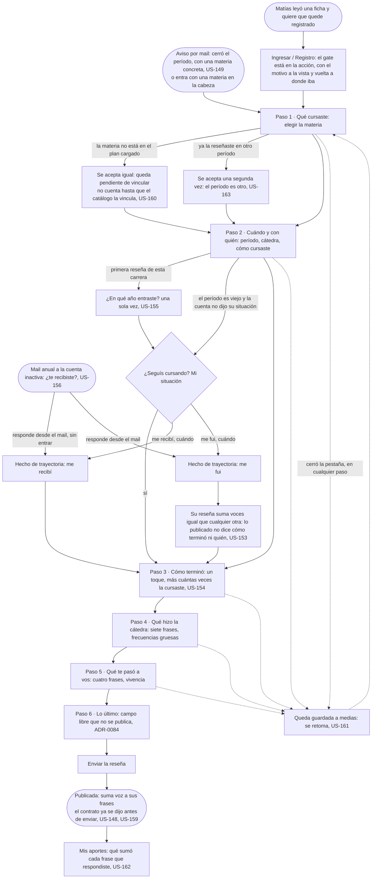

# Reseñar: el flujo

> Reemplaza a las filas 03, 05, 12 y 14 de la tabla de flujos del [mapa](../../map.md) (Matías vuelve y esta vez completa; Lucía reseña; qué se publica; cuando el dato no me alcanza), que ahora son un solo recorrido con sus ramas, reescrito el 2026-08-26 a los seis pasos de [ADR-0082](../../../decisions/0082-the-review-captures-the-cursada-in-three-layers.md). Personas: Lucía, Matías (llega desde una ficha y recién ahí pasa el umbral) y Diego (llega sin cursar). Disparador: el aviso al cerrar el período, una ficha que se acaba de leer, o entrar con una materia en la cabeza. Stories que cubre: los 18 de la épica (US-146 a US-163, salvo US-157 y US-158, cuyo mecanismo quedó rebasado: ver sus stories), más las garantías US-169 y US-170 que se verifican acá.

## Pantallas

- [Reseñar](screens/SC-015-write-review/README.md): los seis pasos completos, de elegir la materia a enviar (nodos B, B2, B3, C, D, E, F, H, I, K, R).
- [Mi situación](screens/SC-014-my-status/README.md): la pregunta de trayectoria, embebida en el paso 2 cuando el período es viejo (nodos G2, G3, G4, G5).
- [Anonimato](screens/SC-013-anonymity/README.md): qué se publica y qué no, el campo libre y el piso, dicho antes de escribir; no es un paso propio del diagrama, se linkea desde el paso 6 y desde cualquier ficha.
- [Ingresar / Registro](../enter/screens/SC-025-sign-in/README.md): el gate que cruza Matías antes de llegar a Reseñar (nodo M1), directo y sin paso intermedio ([ADR-0086](../../../decisions/0086-the-product-informs-it-does-not-track-your-degree.md)); ver también [Registro](../enter/screens/SC-026-sign-up/README.md).
- [Mis aportes](../undo/screens/SC-018-my-contributions/README.md): a donde vuelve la reseña publicada, con lo que sumó cada frase (nodo L).
- [Avisos](../../notices/screens/SC-034-mail/README.md): los dos mails que disparan el flujo, el del cierre de período y el reenganche anual (nodos A, A2).

## Salidas y errores

- **La materia no está** (US-160): se acepta, queda pendiente de vincular a la materia canónica; el autor la ve como pendiente en Mis aportes; no cuenta en ninguna ficha ni en la cobertura hasta que US-197 la vincule.
- **El período es viejo y no dijo su situación**: la pregunta de Mi situación aparece acá, una sola vez; si no contesta, queda como "no dijo" (nunca se infiere).
- **Ya reseñó esta materia**: se acepta una segunda si el período es otro (la reseña es cuenta × materia × período); la cátedra, que es opcional, no entra en la clave.
- **Cerró la pestaña**: la reseña a medias se guarda y aparece para retomar (US-161).
- **El contrato antes de enviar**: en el paso 6 se dice, con estas palabras o parecidas, que la respuesta se suma al total de la cátedra, que ninguna reseña individual se muestra jamás (ni cómo terminó nadie), y el estado del piso de esa cátedra ("junta 3 reseñas: con 7 más se publica"). No es un chequeo que retenga nada: el campo libre nunca se publica, así que no hay texto público que revisar antes de enviar (US-148, US-159, [ADR-0084](../../../decisions/0084-free-text-feeds-curation-and-is-never-published.md)).
- **Sin cuenta**: no se llega a Reseñar; el gate está en la acción (Ingresar / Registro, con el motivo a la vista y vuelta a donde ibas), no en la lectura. Nada se pide antes: del Registro se sale directo a leer o a reseñar, sin pasos intermedios (US-170, [ADR-0086](../../../decisions/0086-the-product-informs-it-does-not-track-your-degree.md)).

## Lo que el flujo no dibuja y la ficha de la pantalla decide

El orden y el colapso por defecto de las frases dentro de los pasos 4 y 5, si el catálogo crece; si el selector de cátedra del paso 2 acepta texto libre además de la lista del catálogo; si el copy "en un grupo chico pueden sospechar" se dice en algún lado además del estado del piso mostrado en el paso 6; qué muestra Mis aportes al terminar.
