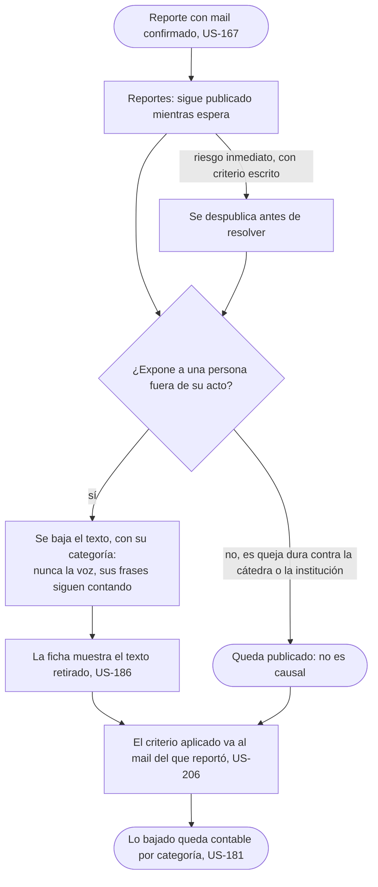
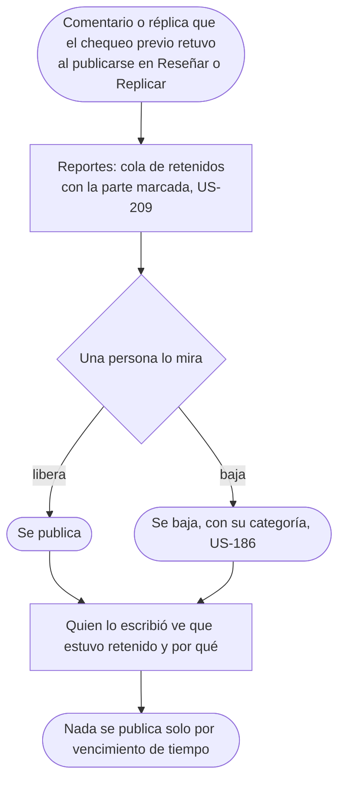
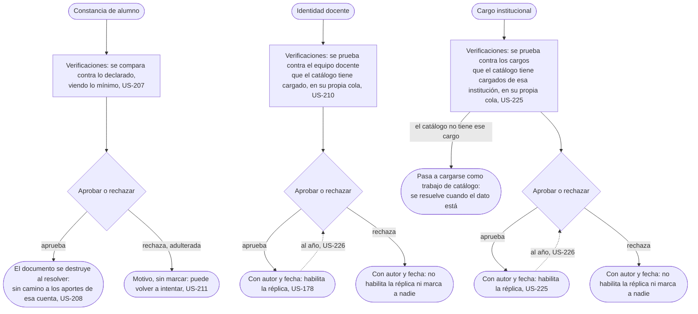
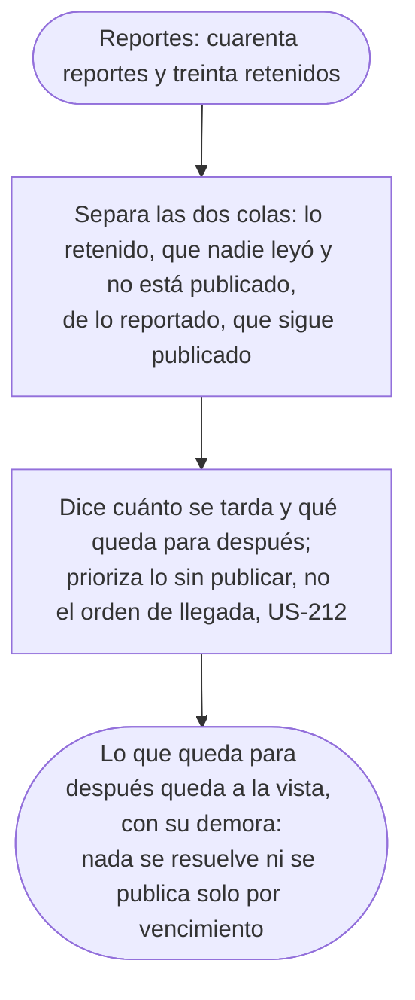
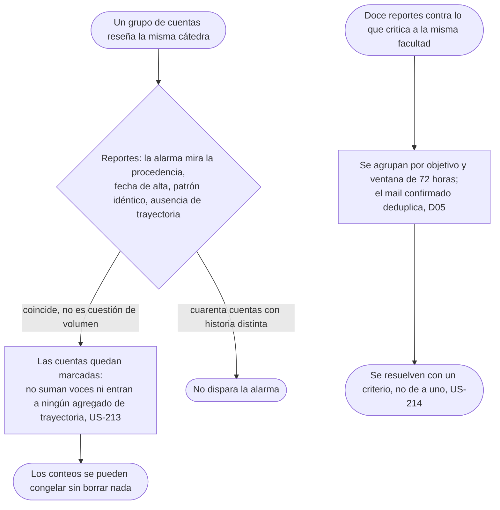

# Moderar sin romper el producto: el flujo

> Reemplaza a las filas BO-3 (Moderar sin bajar la queja incómoda), BO-4 (Ver un nombre una sola vez), BO-8 (Lo que el chequeo previo retuvo), BO-6 (Cuando alguien intenta inflar el corpus) y la mitad de BO-7 (Cuando la cola nos gana) que habla de la cola de moderación, de la tabla de flujos del [mapa](../../map.md). Personas: Nahuel (BO-3, BO-6, BO-7, BO-8), Camila (BO-4). Disparador: un reporte con mail confirmado, algo que el chequeo previo retuvo al publicarse, una constancia, una identidad docente o un cargo institucional que alguien sube para verificar, que pase un año desde la última verificación, o un patrón de cuentas o de reportes que no se explica por cuánta gente vivió lo mismo. Stories que cubre: US-205 a US-210, US-211, US-212, US-213, US-214, US-167, US-178, US-181, US-186, US-225, US-226.

### BO-3: moderar sin bajar la queja incómoda

Pantalla: [Reportes](screens/SC-031-reports/README.md).

### BO-8: lo que el chequeo previo retuvo

Pantalla: [Reportes](screens/SC-031-reports/README.md).

### BO-4: ver un nombre una sola vez

Pantalla: [Verificaciones](screens/SC-032-verifications/README.md).

### Cuando la cola nos gana: cuarenta reportes, treinta retenidos

Pantalla: [Reportes](screens/SC-031-reports/README.md).

> **La cola de Verificaciones también se desborda, y no la absorbe esta persona.** Verificación y moderación no pueden convivir en el mismo rol ([US-217](../cut-the-access/README.md#stories)): es imposible de asignar, no algo que se audite después. Su sobrecarga se prioriza igual (US-212) pero en [Verificaciones](screens/SC-032-verifications/README.md) y con otro operador. El caso de la constancia adulterada se resuelve ahí, y está dibujado en BO-4.

### BO-6: cuando alguien intenta inflar el corpus

Pantalla: [Reportes](screens/SC-031-reports/README.md).

## Salidas y errores

- **El único caso que despublica antes de resolver es el riesgo inmediato**, con criterio escrito: todo lo demás reportado sigue visible mientras espera.
- **La queja dura contra la cátedra o la institución no es causal**: se modera la exposición de una persona, no lo que incomoda a quien evalúan.
- **Nada baja ni se publica solo por cantidad ni por vencimiento**: en las dos colas de Reportes decide una persona.
- **La constancia adulterada se rechaza con motivo y sin marcar** a quien la subió: puede volver a intentar (US-211).
- **Rechazar la identidad docente no habilita la réplica ni marca a nadie**: no es una sanción, es la ausencia del permiso. Lo mismo vale para el cargo institucional (US-225); si el catálogo todavía no tiene ese cargo cargado, el pedido pasa a catálogo en vez de rechazarse.
- **Una identidad verificada, docente o institucional, vence al año y vuelve a la cola para revisarse de nuevo**: lo ya publicado con ella no se retira, porque era cierto cuando se publicó (US-226).
- **Lo retenido no es lo reportado**: lo retenido nadie lo leyó y no está publicado; lo reportado sigue publicado mientras espera; la cola prioriza lo sin publicar (US-212).
- **Cuarenta cuentas con historia distinta reseñando la misma cátedra no disparan la alarma**: mira la procedencia, no el volumen (US-213); una cuenta marcada deja de sumar, pero su reseña no se borra; congelar un conteo no lo pone en cero.
- **El mail confirmado deduplica**: dos reportes del mismo mail sobre el mismo objetivo cuentan uno (D05, US-214).

## Lo que el flujo no dibuja y la ficha de la pantalla decide

Qué ve exactamente Nahuel de un comentario retenido, la reseña entera o solo la parte marcada; cómo se ordenan entre sí las dos colas de Reportes cuando las dos tienen pendientes; el copy exacto del estado "retenido" que ve el autor.
