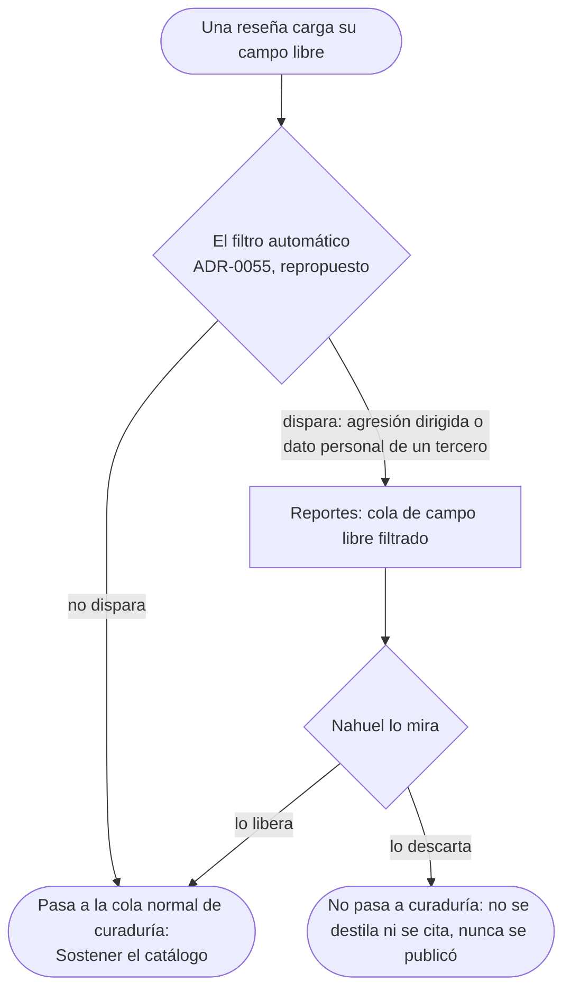
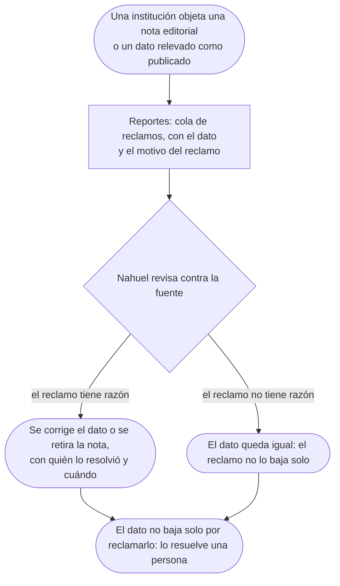
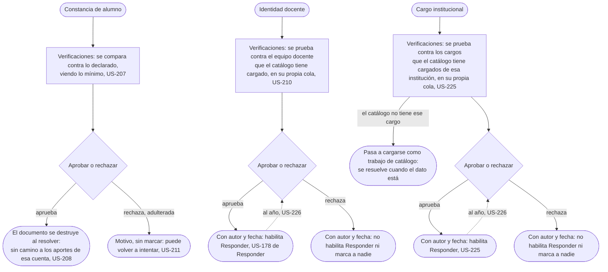
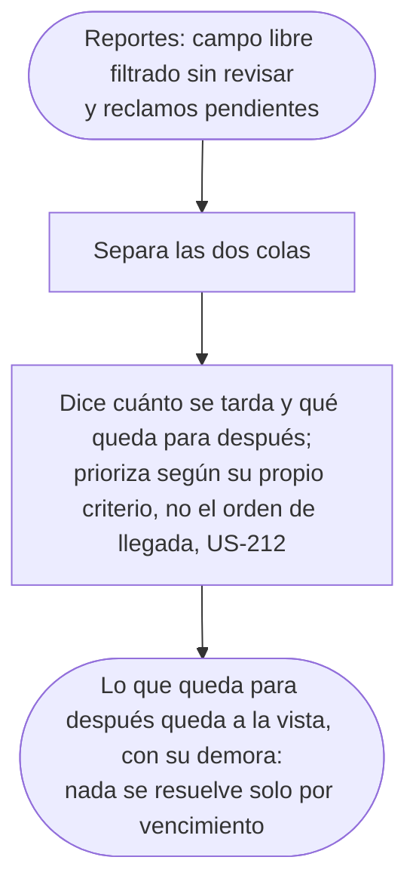

# Moderar sin romper el producto: el flujo

> Reemplaza a las filas BO-3 (Moderar sin bajar la queja incómoda), BO-4 (Ver un nombre una sola vez), BO-8 (Lo que el chequeo previo retenía) y BO-6 (Cuando alguien intenta inflar el corpus) de la tabla de flujos del [mapa](../../map.md); ya no hay contenido público que reportar, así que BO-3 y BO-8 se reemplazan por el filtro grueso del campo libre y el canal de reclamos. Personas: Nahuel (filtro grueso, reclamos, cuentas correlacionadas), Camila (verificaciones). Disparador: una reseña que carga su campo libre, una institución que objeta un dato publicado, una constancia, una identidad docente o un cargo institucional que alguien sube para verificar, que pase un año desde la última verificación, o un patrón de cuentas que no se explica por cuánta gente vivió lo mismo. Stories que cubre: US-207, US-208, US-210, US-211, US-212, US-213, US-214, US-225, US-226.

### El filtro grueso del campo libre

Pantalla: [Reportes](screens/SC-031-reports/README.md).

### El canal de reclamos

Pantalla: [Reportes](screens/SC-031-reports/README.md).

### BO-4: ver un nombre una sola vez

Pantalla: [Verificaciones](screens/SC-032-verifications/README.md).

### Cuando la cola nos gana

Pantalla: [Reportes](screens/SC-031-reports/README.md).

> **La cola de Verificaciones también se desborda, y no la absorbe esta persona.** Verificación y moderación no pueden convivir en el mismo rol ([US-217](../cut-the-access/README.md#stories)): es imposible de asignar, no algo que se audite después. Su sobrecarga se prioriza igual (US-212) pero en [Verificaciones](screens/SC-032-verifications/README.md) y con otro operador. El caso de la constancia adulterada se resuelve ahí, y está dibujado arriba.

### Cuando alguien intenta inflar el corpus

Pantalla: [Reportes](screens/SC-031-reports/README.md).

## Salidas y errores

- **El filtro grueso del campo libre no bloquea nada público**: el campo libre nunca se publicó, así que lo único que decide es si pasa a curaduría filtrado o directo.
- **Ningún reclamo baja un dato solo**: en las dos colas de Reportes decide una persona, con un criterio escrito.
- **La constancia adulterada se rechaza con motivo y sin marcar** a quien la subió: puede volver a intentar (US-211).
- **Rechazar la identidad docente no habilita Responder ni marca a nadie**: no es una sanción, es la ausencia del permiso. Lo mismo vale para el cargo institucional (US-225); si el catálogo todavía no tiene ese cargo cargado, el pedido pasa a catálogo en vez de rechazarse.
- **Una identidad verificada, docente o institucional, vence al año y vuelve a la cola para revisarse de nuevo**: lo ya publicado con ella no se retira, porque era cierto cuando se publicó (US-226).
- **Cuarenta cuentas con historia distinta reseñando la misma cátedra no disparan la alarma**: mira la procedencia, no el volumen (US-213); una cuenta marcada deja de sumar, pero su reseña no se borra; congelar un conteo no lo pone en cero.
- **El mail confirmado deduplica**: dos reclamos del mismo mail sobre el mismo objetivo cuentan uno (D05, US-214).

## Lo que el flujo no dibuja y la ficha de la pantalla decide

Cómo se ordenan entre sí las colas de Reportes cuando las tres (filtro, reclamos, alarma) tienen pendientes; el copy exacto del criterio escrito de cada guardia.
